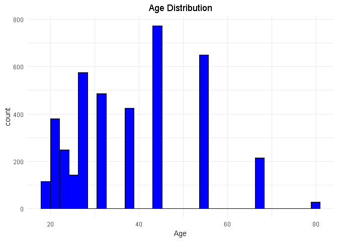
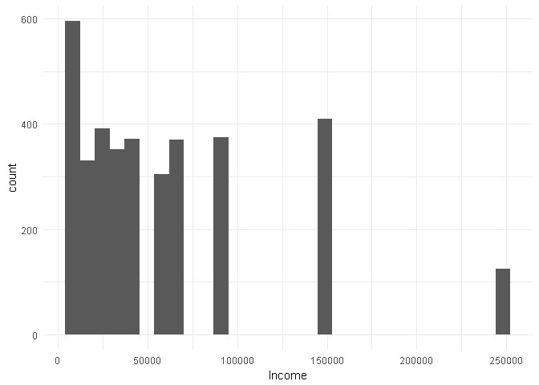
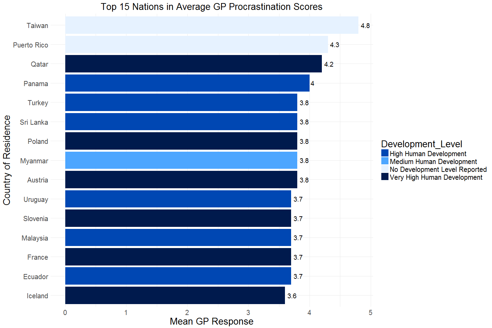
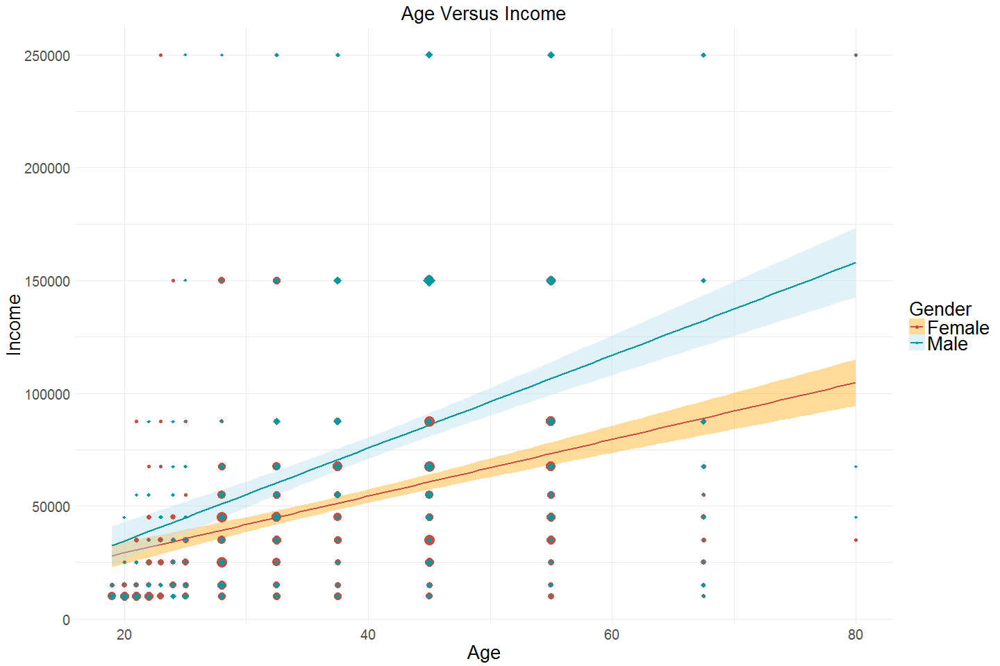
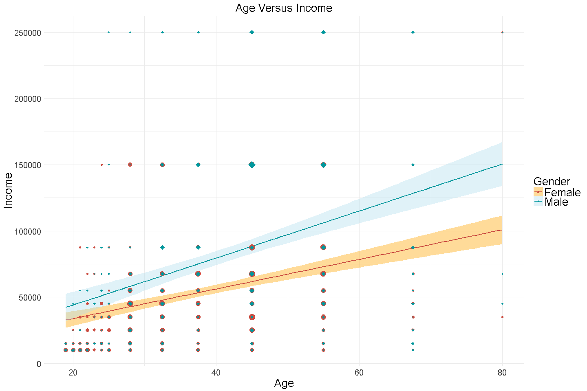
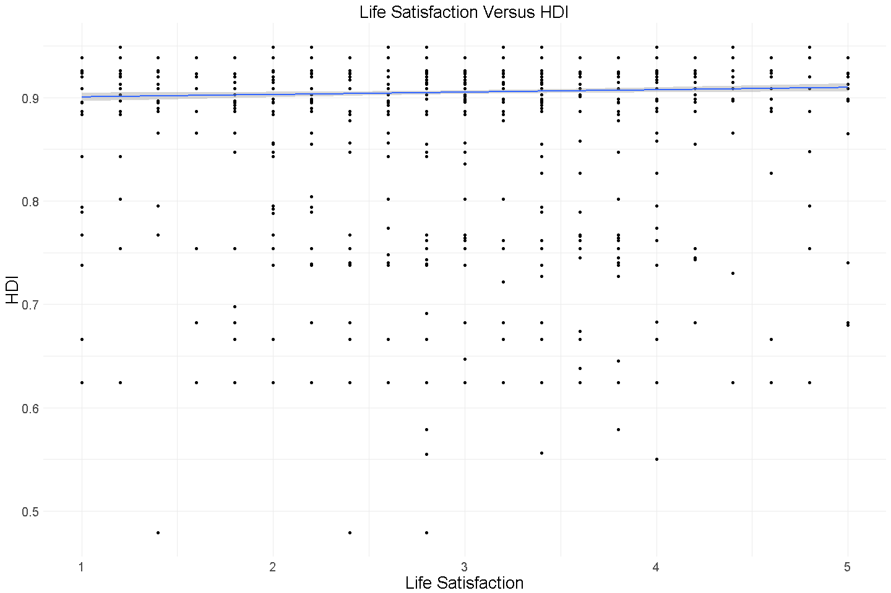
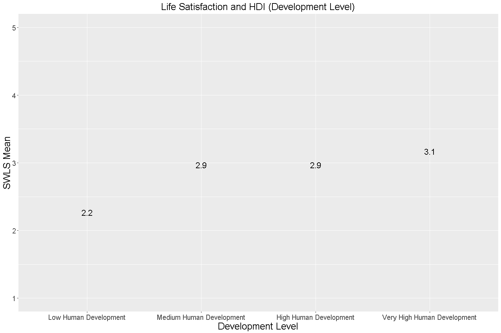

# Procrastination and Human Development
Arturo Casillas & Eric McCandless (ACEM Research. Inc.)  
November 26, 2017  


## Introduction/Background

The Better World Organization (BWO) is a socioeconomic thinktank that is interested in better understanding the relationship between procrastination and the development of countries in the world.  BWO hired ACEM Research to analyze this topic.  Specifically, BWO has asked ACEM to provide the answers to a few specific questions.  

- Top 15 Nations According to the Decisional Procrastination Scale
- Top 15 Nations According to the General Procrastination Scale
- Relationship Between Life Satisfaction and Human Development Index 
- Relationship Between Life Satisfaction and Human Development Index Levels

As part of the analysis, ACEM collected procrastination data and used the HDI from the United Nations.  More information about these sources is provided in the README documentation.

Additionally, initial analysis of the data needed to be conducted to assess whether there are any biases within the data set worth noting.  Analysis included:

- Descriptive Statistics - age, income, HDI, Procrastination data mean scores
- Histogram for Age 
- Histogram for Income
- Participants by Gender
- Participants by Work Status
- Participants by Occupation
- Participants by Country 
- Perceptions of Procrastination 

Analysis conducted via R. More details about the system information can be found in the README.

##Sources/Data

The two primary data sources for this analysis were the following:

  - Procrastination file
      - From a study funded by the client (BWO) through Qualtrics containing answers to various survey questions centered on Procrastination as well as demographic information
      
  - HDI table
      - List of HDI indexes per country, measured by the United Nations and located on Wikipedia


```r
library(knitr)
library(xml2)
library(rvest)
library(ggplot2)
library(pander)
#opts_knit$set(root.dir = "~/Documents/")
#getwd()
```

Procrastination data imported and cleaned


Import the data. It has 4,264 observations and 61 variables:


```r
# #2.
# #read the data
# #This assumes that CaseStudy2 is your working directory
# #2.a.
procrastination<-read.csv('./Data/Procrastination.csv', header=TRUE, na.strings=c(""," ","NA"))
#read_chunk('./Analysis/procrastination_data.R')

#2.a.
#dimensions
dim(procrastination)
```

```
## [1] 4264   61
```


Clean data variable by variable:

Go through variables one by one

  - Rename if necessary to keep 12 characters and under (Q2b)
  - Define appropriate missing values: '0' or NA when numeric and blank or NA when character
   - For example, work status has a '0' instead of 'full-time' or 'retired'. This was changed to a missing value
   - County of Residence of '0 is set to missing (Q2ciii)
  - Fix when factor labels are not applied correctly
   - Sons has 'Male' and 'Female' instead of 1 and 2 (Q2cii)
   - Survey responses on whether others consider the respondent a procrastinator is a factor variable where '5' is yes and '4' is 'no' when read numerically. Data was thus modified so that an observed factor level of '4' corresponds to 'no'
   - Similarly, analysis of how the factor levels were defined led us to modify the number '8' to a 'Small City' community
  - Unrealistic values are defined as missing
   - For example, when respondents claim to be working at their current job for 999 years, the response is set to missing
  - Correct spelling mistakes in respondents' write-in answers so that observations can be more easily categorized if analysis demands (Q2civ)
   - For example: 'Studey' was corrected to 'student'
   - Furthermore, 'na', '0', and 'please specify' were set to missing
  - Additional information about this data can be found in the CODEBOOK


```r
#2.b.-2.c.

### Clean data by variable ###

#rename levels or change values

names(procrastination)[1]<-'Age'

names(procrastination)[4]<-'Education'

#names(procrastination)[5]<-'Work.Status'
levels(procrastination$Work.Status)[match('0', levels(procrastination$Work.Status))]<-NA #''

names(procrastination)[6]<-'Income.Year'
#tail(sort(procrastination$Income.Year), 150)
#Consider that the incomes are buckets not values
#unique(procrastination$Income.Year)

names(procrastination)[7]<-'Current.Job'
#unique(procrastination$Current.Job)
#define missing
levels(procrastination$Current.Job)[match('na', levels(procrastination$Current.Job))]<-NA
levels(procrastination$Current.Job)[match('0', levels(procrastination$Current.Job))]<-NA
levels(procrastination$Current.Job)[match('please specify', levels(procrastination$Current.Job))]<-NA

#Fix Misspellings
#ouh could be oxford university hospital was not changed
#check for other info about 's'
#procrastination[procrastination$Current.Job == 's',]
levels(procrastination$Current.Job)[match('s', levels(procrastination$Current.Job))]<-'student'
levels(procrastination$Current.Job)[match('Studey', levels(procrastination$Current.Job))]<-'student'
levels(procrastination$Current.Job)[match('psychologis', levels(procrastination$Current.Job))]<-'psychologist'
levels(procrastination$Current.Job)[match('mktg', levels(procrastination$Current.Job))]<-'Marketing'
levels(procrastination$Current.Job)[match('MD', levels(procrastination$Current.Job))]<-'Physician'
levels(procrastination$Current.Job)[match('Economy', levels(procrastination$Current.Job))]<-'Economist'
levels(procrastination$Current.Job)[match('vidoe', levels(procrastination$Current.Job))]<-'video'
levels(procrastination$Current.Job)[match(' houswife', levels(procrastination$Current.Job))]<-'Housewife'
#gsub('â???"', '', levels(procrastination$Current.Job))
levels(procrastination$Current.Job)[match('\'Utterly shiftless arts student\'... at p', levels(procrastination$Current.Job))]<-'student'
levels(procrastination$Current.Job)[match('asst', levels(procrastination$Current.Job))]<-'Assistant'
#Consolidate Attrorneys
levels(procrastination$Current.Job)[match('attorney', levels(procrastination$Current.Job))]<-'Attorney'
levels(procrastination$Current.Job)[match('Attorney â???" Associate', levels(procrastination$Current.Job))]<-'Attorney'
levels(procrastination$Current.Job)[match('Attorney - self employed for 2 years â???" f', levels(procrastination$Current.Job))]<-'Attorney'
levels(procrastination$Current.Job)[match('Editor Attorney', levels(procrastination$Current.Job))]<-'Attorney'
levels(procrastination$Current.Job)[match('Assistant District Attorney', levels(procrastination$Current.Job))]<-'Attorney'
levels(procrastination$Current.Job)[match(' Attorney-self employed', levels(procrastination$Current.Job))]<-'Attorney'


names(procrastination)[8]<-'Years.Empl.'
#tail(sort(procrastination$Years.Empl.), 50)
#999 years is missing since we don't know what it means
procrastination$Years.Empl.<-ifelse(procrastination$Years.Empl. == 999, NA, procrastination$Years.Empl.)
procrastination$Years.Empl.<-round(procrastination$Years.Empl)

names(procrastination)[9]<-'Months.Empl.'

names(procrastination)[10]<-'Comm.Size'
#CHeck if 8 or 0 corresponds to a category if numeric
#procrastination$Comm.Size[as.numeric(procrastination$Comm.Size) == 8]
#procrastination$Comm.Size[as.numeric(procrastination$Comm.Size) == 0]
#Change to 'Small City based on other responses
levels(procrastination$Comm.Size)[match('8', levels(procrastination$Comm.Size))]<-'Small City'
levels(procrastination$Comm.Size)[match('0', levels(procrastination$Comm.Size))]<-NA

names(procrastination)[11]<-'Country'
levels(procrastination$Country)[match('0', levels(procrastination$Country))]<-NA
levels(procrastination$Country)[match('', levels(procrastination$Country))]<-NA
#levels(procrastination$Country)[match(' ', levels(procrastination$Country))]<-'<NA>'

names(procrastination)[12]<-'Marital.Stat'
levels(procrastination$Marital.Stat)[match('0', levels(procrastination$Marital.Stat))]<-NA

names(procrastination)[13]<-'Sons'
levels(procrastination$Sons)[match('Male', levels(procrastination$Sons))]<-'1'
levels(procrastination$Sons)[match('Female', levels(procrastination$Sons))]<-'2'
#Convert to numeric
procrastination$Sons = as.numeric(as.character(procrastination$Sons))

names(procrastination)[14]<-'Daughters'
#procrastination$Daughters = as.numeric(procrastination$Daughters)

names(procrastination)[15]<-'XDP1'
names(procrastination)[16]<-'XDP2'
names(procrastination)[17]<-'XDP3'
names(procrastination)[18]<-'XDP4'
names(procrastination)[19]<-'XDP5'
names(procrastination)[20]<-'XAIP1'
names(procrastination)[21]<-'XAIP2'
names(procrastination)[22]<-'XAIP3'
names(procrastination)[23]<-'XAIP4'
names(procrastination)[24]<-'XAIP5'
names(procrastination)[25]<-'XAIP6'
names(procrastination)[26]<-'XAIP7'
names(procrastination)[27]<-'XAIP8'
names(procrastination)[28]<-'XAIP9'
names(procrastination)[29]<-'XAIP10'
names(procrastination)[30]<-'XAIP11'
names(procrastination)[31]<-'XAIP12'
names(procrastination)[32]<-'XAIP13'
names(procrastination)[33]<-'XAIP14'
names(procrastination)[34]<-'XAIP15'
names(procrastination)[35]<-'XGP1'
names(procrastination)[36]<-'XGP2'
names(procrastination)[37]<-'XGP3'
names(procrastination)[38]<-'XGP4'
names(procrastination)[39]<-'XGP5'
names(procrastination)[40]<-'XGP6'
names(procrastination)[41]<-'XGP7'
names(procrastination)[42]<-'XGP8'
names(procrastination)[43]<-'XGP9'
names(procrastination)[44]<-'XGP10'
names(procrastination)[45]<-'XGP11'
names(procrastination)[46]<-'XGP12'
names(procrastination)[47]<-'XGP13'
names(procrastination)[48]<-'XGP14'
names(procrastination)[49]<-'XGP15'
names(procrastination)[50]<-'XGP16'
names(procrastination)[51]<-'XGP17'
names(procrastination)[52]<-'XGP18'
names(procrastination)[53]<-'XGP19'
names(procrastination)[54]<-'XGP20'
names(procrastination)[55]<-'SWLS1'
names(procrastination)[56]<-'SWLS2'
names(procrastination)[57]<-'SWLS3'
names(procrastination)[58]<-'SWLS4'
names(procrastination)[59]<-'SWLS5'

names(procrastination)[60]<-'Self.Assess'

names(procrastination)[61]<-'Other.Assess'
#Check if '4' or '0' correspond to a category under numeric coding
#procrastination$Other.Assess[as.numeric(procrastination$Other.Assess) == 4]
#procrastination$Other.Assess[as.numeric(procrastination$Other.Assess) == 0]
levels(procrastination$Other.Assess)[match('4', levels(procrastination$Other.Assess))]<-'no'
levels(procrastination$Other.Assess)[match('0', levels(procrastination$Other.Assess))]<-NA
```


To simplify the analysis, variables were aggregated within each set of procrastination and life satisfaction measures (GP, DP, AIP, and life statisfaction) by calculating a mean score (Q2e).


```r
#2.e.
#Create means for category of survey questions
#First, find the indexes of the survey category in question
#Then, use apply() to find the row mean only for those categories

XGP<-grep( 'XGP', names(procrastination))
procrastination$XGP.Mean<-apply(procrastination[,XGP], 1, mean, na.rm=TRUE)

XDP<-grep( 'XDP', names(procrastination))
procrastination$XDP.Mean<-apply(procrastination[,XDP], 1, mean, na.rm=TRUE)

XAIP<-grep( 'XAIP', names(procrastination))
procrastination$XAIP.Mean<-apply(procrastination[,XAIP], 1, mean, na.rm=TRUE)

SWLS<-grep( 'SWLS', names(procrastination))
procrastination$SWLS.Mean<-apply(procrastination[,SWLS], 1, mean, na.rm=TRUE)
```

ACEM also conducted secondary analysis to confirm data validity via munging (Q2d).


```r
#2.d.
#Double Check Character and Numeric
str(procrastination)
```

```
## 'data.frame':	4264 obs. of  65 variables:
##  $ Age         : num  67.5 45 19 37.5 28 23 67.5 37.5 24 45 ...
##  $ Gender      : Factor w/ 2 levels "Female","Male": 2 2 1 2 1 1 1 2 1 2 ...
##  $ Kids        : Factor w/ 2 levels "No Kids","Yes Kids": 2 2 1 2 1 1 1 1 1 2 ...
##  $ Education   : Factor w/ 8 levels "deg","dip","grade",..: 7 1 2 7 1 1 7 3 7 7 ...
##  $ Work.Status : Factor w/ 5 levels "full-time","part-time",..: 3 2 4 1 1 1 2 2 1 1 ...
##  $ Income.Year : int  25000 35000 NA 45000 35000 15000 NA 10000 250000 87500 ...
##  $ Current.Job : Factor w/ 663 levels "student"," Accountant",..: NA NA NA NA NA NA NA NA NA NA ...
##  $ Years.Empl. : num  9 0 0 14 1 1 8 NA 2 14 ...
##  $ Months.Empl.: int  0 0 0 0 0 0 0 0 0 0 ...
##  $ Comm.Size   : Factor w/ 7 levels "Small City","Large-City",..: 2 7 3 3 7 6 3 7 7 7 ...
##  $ Country     : Factor w/ 92 levels "Afghanistan",..: 29 13 23 24 24 24 58 86 86 71 ...
##  $ Marital.Stat: Factor w/ 5 levels "Divorced","Married",..: 1 2 4 2 4 4 1 4 4 2 ...
##  $ Sons        : num  0 1 0 0 0 0 0 0 0 2 ...
##  $ Daughters   : int  5 1 0 1 0 0 0 0 0 0 ...
##  $ XDP1        : int  3 3 5 3 3 3 3 4 2 5 ...
##  $ XDP2        : int  1 4 5 3 3 4 4 3 2 5 ...
##  $ XDP3        : int  1 3 2 3 2 3 3 4 4 5 ...
##  $ XDP4        : int  1 3 3 3 1 2 2 4 4 5 ...
##  $ XDP5        : int  1 3 3 3 1 2 2 3 4 5 ...
##  $ XAIP1       : int  1 3 5 2 1 2 3 4 3 3 ...
##  $ XAIP2       : int  1 1 4 1 1 5 1 4 3 3 ...
##  $ XAIP3       : int  1 4 4 4 3 5 1 4 3 5 ...
##  $ XAIP4       : int  1 3 5 3 3 5 2 4 4 3 ...
##  $ XAIP5       : int  1 3 5 5 2 5 3 4 4 5 ...
##  $ XAIP6       : int  1 4 5 3 2 3 3 2 2 1 ...
##  $ XAIP7       : int  1 3 5 4 2 5 1 5 2 5 ...
##  $ XAIP8       : int  1 3 4 5 2 4 4 2 4 5 ...
##  $ XAIP9       : int  5 3 5 4 1 4 5 4 2 5 ...
##  $ XAIP10      : int  1 3 5 5 1 5 5 3 2 5 ...
##  $ XAIP11      : int  1 4 4 4 2 3 3 2 4 4 ...
##  $ XAIP12      : int  1 2 3 3 1 5 2 4 4 4 ...
##  $ XAIP13      : int  1 2 5 4 2 4 3 3 4 4 ...
##  $ XAIP14      : int  1 2 4 2 1 5 1 4 3 4 ...
##  $ XAIP15      : int  3 4 3 1 2 5 4 5 3 5 ...
##  $ XGP1        : int  1 4 5 4 4 5 4 5 3 5 ...
##  $ XGP2        : int  1 2 2 1 1 5 1 1 4 3 ...
##  $ XGP3        : int  1 2 2 3 2 2 1 3 3 3 ...
##  $ XGP4        : int  1 2 4 3 4 5 1 4 4 1 ...
##  $ XGP5        : int  1 2 3 2 5 4 1 3 2 5 ...
##  $ XGP6        : int  1 2 1 3 2 4 2 3 2 5 ...
##  $ XGP7        : int  1 4 3 4 4 5 3 4 4 5 ...
##  $ XGP8        : int  1 2 2 5 2 4 2 3 2 4 ...
##  $ XGP9        : int  1 4 5 4 4 4 4 4 4 5 ...
##  $ XGP10       : int  1 2 4 1 1 3 1 4 1 3 ...
##  $ XGP11       : int  5 3 5 3 2 4 4 3 5 5 ...
##  $ XGP12       : int  1 4 5 4 3 4 2 5 2 5 ...
##  $ XGP13       : int  1 2 3 3 2 3 3 2 3 4 ...
##  $ XGP14       : int  1 2 4 3 4 4 2 2 2 4 ...
##  $ XGP15       : int  1 3 5 4 3 4 4 4 1 4 ...
##  $ XGP16       : int  1 4 2 4 2 4 3 4 5 5 ...
##  $ XGP17       : int  1 3 3 3 3 4 1 3 5 3 ...
##  $ XGP18       : int  5 3 5 4 2 4 4 4 1 5 ...
##  $ XGP19       : int  1 4 5 5 3 4 4 4 1 5 ...
##  $ XGP20       : int  5 4 4 1 4 4 2 4 3 5 ...
##  $ SWLS1       : int  5 3 2 2 4 3 3 3 4 1 ...
##  $ SWLS2       : int  5 4 2 4 4 2 4 3 4 4 ...
##  $ SWLS3       : int  5 4 2 2 4 4 3 3 5 2 ...
##  $ SWLS4       : int  5 4 3 2 3 4 3 2 4 4 ...
##  $ SWLS5       : int  5 3 4 2 4 3 2 3 4 1 ...
##  $ Self.Assess : Factor w/ 2 levels "no","yes": 1 2 2 2 1 2 2 2 1 2 ...
##  $ Other.Assess: Factor w/ 2 levels "no","yes": 1 2 2 2 1 2 2 2 1 2 ...
##  $ XGP.Mean    : num  1.6 2.9 3.6 3.2 2.85 4 2.45 3.45 2.85 4.2 ...
##  $ XDP.Mean    : num  1.4 3.2 3.6 3 2 2.8 2.8 3.6 3.2 5 ...
##  $ XAIP.Mean   : num  1.4 2.93 4.4 3.33 1.73 ...
##  $ SWLS.Mean   : num  5 3.6 2.6 2.4 3.8 3.2 3 2.8 4.2 2.4 ...
```

```r
# #apply(procrastination, 2, class)
# catch=NA
# for(i in 1:length(procrastination[1,])){catch<-c(catch, is.numeric(procrastination[,i]))}
# #catch[-1]
# 
# #Numeric Summary
# apply(procrastination[,catch[-1]], 2, summary)
# 
# #Character Summary
# apply(procrastination[,!catch[-1]], 2, unique)
# 
# aggregate(procrastination[,!catch[-1]], by= , FUN=is.na)
```


ACEM scraped and cleaned HDI data for analysis and merging to procrastination data (Q3a-Q3b). 


```r
#Access tables on website and save and clean each of the 8 tables.

hdi_url <- ("https://en.wikipedia.org/wiki/List_of_countries_by_Human_Development_Index#Complete_list_of_countries")

hdi1 <- hdi_url %>%
  html() %>%
  html_nodes('table') %>%
  .[[3]] %>%
  html_table(fill=TRUE)
hdi1 <- hdi1[,-c(1:2),]
hdi1 <- hdi1[,-c(3:273),]
hdi1 <- hdi1[-c(1:3),]
colnames(hdi1) <- c("Country","HDI")
hdi1 <- hdi1[-c(27:28),]

hdi2 <- hdi_url %>%
  html() %>%
  html_nodes('table') %>%
  .[[6]] %>%
  html_table(fill=TRUE)
hdi2 <- hdi2[,-c(1:2),]
hdi2 <- hdi2[,-c(3:298),]
hdi2 <- hdi2[-c(1:3),]
colnames(hdi2) <- c("Country","HDI")
hdi2 <- hdi2[-c(29:30),]

hdi3 <- hdi_url %>%
  html() %>%
  html_nodes('table') %>%
  .[[9]] %>%
  html_table(fill=TRUE)
hdi3 <- hdi3[,-c(1:2),]
hdi3 <- hdi3[,-c(3:223),]
hdi3 <- hdi3[-c(1:3),]
colnames(hdi3) <- c("Country","HDI")
hdi3 <- hdi3[-c(21:22),]

hdi4 <- hdi_url %>%
  html() %>%
  html_nodes('table') %>%
  .[[12]] %>%
  html_table(fill=TRUE)
hdi4 <- hdi4[,-c(1:2),]
hdi4 <- hdi4[,-c(3:223),]
hdi4 <- hdi4[-c(1:3),]
colnames(hdi4) <- c("Country","HDI")
hdi4 <- hdi4[-c(22:23),]

#Bind tables and convert HDI to numeric for analysis.

hdi_total <- rbind(hdi1, hdi2, hdi3, hdi4)
hdi_total$HDI <- as.numeric(hdi_total$HDI)

#Create HDI category column and assign category to each country.

hdi_total$Development_Level <- cut(hdi_total$HDI,
                       breaks = c(-Inf, .550, .701, .800, Inf), 
                       labels = c("Low Human Development", "Medium Human Development", "High Human Development", "Very High Human Development"),
                       right = FALSE)

#saved file "hdi.csv" to Data file in repo:
#write.csv(hdi_total, "~/CaseStudy2/Data/hdi.csv", row.names=FALSE)
```

Then, HDI data was merged with procrastination data by country of residence (Q3c)
 
 - Corrected the spelling of Israel and Colombia in the procrastination data
 
 - No HDI information for Antiqua, Bermuda, Guam, Macao, Puerto Rico, and the former Yogoslavia


```r
############## MERGE THE TWO DATASESTS ################

#3.c.
#THis requires both 'procrasintation' and 'hdi_total' from previous codes

#Check Spellings
#sort(unique(procrastination$Country))
#sort(unique(hdi_total$Country))

#Use Spanish Spelling of COlumbia
levels(procrastination$Country)[match('Columbia', levels(procrastination$Country))]<-'Colombia'
#Use correct Spelling of Israel
levels(procrastination$Country)[match('Isreal', levels(procrastination$Country))]<-'Israel'

procrast_hdi<-merge(x=procrastination, y=hdi_total, by.x='Country', by.y='Country', all.x = TRUE)

##Check results
#summary(test$procrast_hdi)
#str(procrast_hdi)

#unique(procrast_hdi$Country[is.na(procrast_hdi$HDI)])
##No HDI for Antiqua, Bermuda, Guam, Macao, Puerto Rico, and former Yogoslavia

#Summary of missing values
#Ta<-table(procrast_hdi$Country[is.na(procrast_hdi$HDI)])
#Ta[Ta > 0]
```

##Additional Information

Additional information about this assessment can be found in the README file in the repository.

##Analysis/Findings

First, ACEM removed age outliers <18 per clients request. (Q4a)


```r
#Removed respondents age<18.
procrast_hdi1 <- procrast_hdi[procrast_hdi$Age>18,]
```

Initial Look at Descriptive Statistics in Merged File - Age, Income, HDI, 4 Mean Scores (Q4b)

Summary data reveals some interesting characteristics:

- Yearly Income is right skewed
- Age is concentrated around a few distinct values.
- at least 50% of HDI values are 0.92


```r
#Summary stats for key variables.
procrast_hdi2 <- apply(procrast_hdi1[,c('Age','Income.Year', 'HDI', 'XGP.Mean', 'XDP.Mean', 'XAIP.Mean', 'SWLS.Mean')], 2, function(y) summary(y, digits = 2))
kable(procrast_hdi2)
```

           Age   Income.Year      HDI   XGP.Mean   XDP.Mean   XAIP.Mean   SWLS.Mean
--------  ----  ------------  -------  ---------  ---------  ----------  ----------
Min.        19         10000     0.48        1.0        1.0         1.0         1.0
1st Qu.     28         15000     0.92        2.8        2.4         2.4         2.4
Median      38         45000     0.92        3.2        3.0         2.9         3.0
Mean        38         60000     0.91        3.2        3.1         3.0         3.0
3rd Qu.     45         88000     0.92        3.8        3.8         3.5         3.8
Max.        80        250000     0.95        5.0        5.0         5.0         5.0
NA's        71           486   242.00       71.0       71.0        71.0        71.0

Histogram for Age (Q4b)

Histogram shows most respondents age 18+ from the study are under 50, however, there is a large segment age 50-60. The distribution appears to be symmetrical. However, respondents are highly clustered at certain age points. 


```r
#histogram to show distribution of respondent age.
ggplot(procrast_hdi1, aes(procrast_hdi1$Age)) +
  geom_histogram(color="black",fill="blue") +
  ggtitle("Age Distribution") +
  theme(plot.title = element_text(hjust = 0.5)) +
  xlab("Age") 
```

<!-- -->

Histogram for Income (Q4b)

Histogram shows most respondents from the study have income below 60K. However, there is a large segment with income of greater than 150K that skews the distribution to the right.


```r
#histogram to show distribution of respondent income.
ggplot(procrast_hdi1, aes(procrast_hdi1$Income.Year)) +
  geom_histogram(color="black",fill="blue") + theme_minimal() +
  ggtitle("Income Distribution") +
  theme(plot.title = element_text(hjust = 0.5)) +
  xlab("Income") 
```

<!-- -->

Participants by Gender (Q4c)

Counts of how many participants there were by gender in decending order.  There were 70 observations without a gender value.  These observations were removed from the list prior to creating the table. For example, we have 773 respondents who are 45 and 0 who are 44 and 0 who are 46.


```r
## We find this more useful than table()
## A different analyst can use table() or a different function ahead
EMTABLE<-function(df, var1 = 'Variable', digits = 1){
  
 # df<-procrast_hdi1$Gender
 # digits = 1
 # var1 = 'Variable'

  procrast_hdi10 <- table(df)
  #Convert to data.frame
  procrast_hdi11 <- data.frame(cbind(procrast_hdi10, prop.table(procrast_hdi10)))
  #Tidy Count and Percentage
  names(procrast_hdi11) <- c("Count", "Percentage")
  procrast_hdi11$Percentage <- round(procrast_hdi11$Percentage * 100, digits=digits)
  #Descending order
  procrast_hdi11 <- procrast_hdi11[order(-procrast_hdi11$Percentage), ,drop = FALSE]
  #Row.Names as column
  procrast_hdi12 <- cbind(rownames(procrast_hdi11), procrast_hdi11)
  names(procrast_hdi12)[1] = var1
  rownames(procrast_hdi12) <- 1:nrow(procrast_hdi12)  
  
  #This outputs this table to our preferred format
  return(procrast_hdi12)

}
```


```r
#4.c.
## These are frequency tables for three key variables

#First, table for gender
Gend.Table<-EMTABLE(procrast_hdi1$Gender, digits=1, var1 = 'Gender')
kable(Gend.Table)
```


Gender    Count   Percentage
-------  ------  -----------
Female     2309         57.3
Male       1721         42.7

Participants by Work Status (Q4c)

Counts of how many participants there were by work status in decending order.  There were 113 observations without a work status value.  These observations were removed from the list prior to creating the table.


```r
#4.c.
#Then, table for work status
WorkStat.Table<-EMTABLE(procrast_hdi1$Work.Status, digits=1, var1 = 'Work Status')
kable(WorkStat.Table)
```


Work Status    Count   Percentage
------------  ------  -----------
full-time       2260         56.6
student          837         21.0
part-time        465         11.6
unemployed       258          6.5
retired          174          4.4

Participants by Occupation (Q4c)

Shown here are the twenty largest counts of how many participants there were by current occupation in decending order of frequency.  There were 2654 observations without an occupation value.  These observations were removed from the list prior to creating the table. Given that this was a write in response, there are a large number of unique responses. A full list of all of responses can be found in the repository.


```r
#4.c.
#Then, table for Job Table
JobTable<-EMTABLE(procrast_hdi1$Current.Job, digits=1, var1 = 'Current Occupation')
kable(JobTable[1:20,])
```


Current Occupation     Count   Percentage
--------------------  ------  -----------
teacher                   74          5.4
Attorney                  52          3.8
college professor         43          3.1
engineer                  32          2.3
manager                   32          2.3
retired                   28          2.0
Editor                    21          1.5
Marketing                 21          1.5
writer                    19          1.4
Unemployed                18          1.3
Housewife                 16          1.2
Doctor; Physician         16          1.2
Software Developer        16          1.2
consultant                12          0.9
Nurse                     13          0.9
Scientist                 12          0.9
Financial Advisor         11          0.8
home maker                11          0.8
Administrator             10          0.7
assistant professor       10          0.7

```r
####EXPORT
#write.csv(JobTable, file='~/Data/Current_Job_Freq.csv')
```


Participants by Country (Q4d)

Counts of how many participants there were by country in decending order.  There were 231 observations without a country name.  These observations were removed from the list prior to creating the table.


```r
#4.d.
#Top 15 countries among our respondents
Country.Table<-EMTABLE(procrast_hdi1$Country, digits=2, var1 = 'Country')
kable(Country.Table)
```


Country               Count   Percentage
-------------------  ------  -----------
United States          2785        71.85
Canada                  243         6.27
United Kingdom          177         4.57
Australia                99         2.55
India                    78         2.01
Italy                    62         1.60
Germany                  36         0.93
Brazil                   20         0.52
Ireland                  19         0.49
Israel                   19         0.49
Netherlands              18         0.46
Sweden                   15         0.39
Norway                   14         0.36
France                   13         0.34
Japan                    13         0.34
Spain                    13         0.34
China                    12         0.31
Finland                  12         0.31
Mexico                   12         0.31
New Zealand              12         0.31
South Africa             12         0.31
Switzerland              12         0.31
Philippines              11         0.28
Greece                   10         0.26
Belgium                   9         0.23
Denmark                   9         0.23
Turkey                    9         0.23
Hong Kong                 7         0.18
Portugal                  7         0.18
Slovenia                  6         0.15
Poland                    5         0.13
Romania                   5         0.13
Afghanistan               4         0.10
Chile                     4         0.10
Croatia                   4         0.10
Malaysia                  4         0.10
Singapore                 4         0.10
Algeria                   3         0.08
Argentina                 3         0.08
Austria                   3         0.08
Czech Republic            3         0.08
Ecuador                   3         0.08
Puerto Rico               3         0.08
Uruguay                   3         0.08
Albania                   2         0.05
Andorra                   2         0.05
Bermuda                   2         0.05
Bulgaria                  2         0.05
Colombia                  2         0.05
Ghana                     2         0.05
Iran                      2         0.05
Malta                     2         0.05
Peru                      2         0.05
Saudi Arabia              2         0.05
South Korea               2         0.05
Thailand                  2         0.05
Ukraine                   2         0.05
Venezuela                 2         0.05
Yugoslavia                2         0.05
Antigua                   1         0.03
Bahamas                   1         0.03
Barbados                  1         0.03
Bolivia                   1         0.03
Botswana                  1         0.03
Brunei                    1         0.03
Cyprus                    1         0.03
Dominican Republic        1         0.03
Egypt                     1         0.03
El Salvador               1         0.03
Guam                      1         0.03
Guyana                    1         0.03
Hungary                   1         0.03
Iceland                   1         0.03
Jamaica                   1         0.03
Kazakhstan                1         0.03
Kenya                     1         0.03
Lithuania                 1         0.03
Luxembourg                1         0.03
Macao                     1         0.03
Macedonia                 1         0.03
Morocco                   1         0.03
Myanmar                   1         0.03
Nicaragua                 1         0.03
Pakistan                  1         0.03
Panama                    1         0.03
Qatar                     1         0.03
Russia                    1         0.03
Sri Lanka                 1         0.03
Taiwan                    1         0.03
Vietnam                   1         0.03
Estonia                   0         0.00
Lebanon                   0         0.00

```r
#Note: NA or no response accounted for 231 participants, putting it in 4th place
```

Perceptions of Procrastination (Q4e)

Data show that 2,841 respondents' perception of whether or not they are a procrastinator matched what others think.  This equates to 69% of the respondent base.


```r
#4.e.
#
Match.Assess <- data.frame('Match.Assess'<-paste(procrast_hdi1$Self.Assess , procrast_hdi1$Other.Assess, sep = "|"))
MatchTable<-EMTABLE(Match.Assess, digits=1, var1 = 'Assessment: Self | Others')
kable(MatchTable)
```


Assessment: Self | Others    Count   Percentage
--------------------------  ------  -----------
yes|yes                       2358         57.4
yes|no                        1107         27.0
no|no                          483         11.8
NA|NA                           78          1.9
no|yes                          51          1.2
yes|NA                          25          0.6
no|NA                            4          0.1
NA|no                            1          0.0

Top 15 Nations According to the Decisional Procrastination Scale - DP (Q5b)


```r
#table that summarizes DP means by country.
DP_Mean <- procrast_hdi1[,c("Country", "XDP.Mean")]
DP_Mean <- aggregate(DP_Mean[, c("XDP.Mean")], list(DP_Mean$Country), mean)
colnames(DP_Mean) <- c("Country", "XDP.Mean")

#second table that shows development level by country.
DP_Mean1 <- procrast_hdi1[,c("Country","Development_Level")]
DP_Mean1 <- unique(DP_Mean1)

#merging 2 tables to get DP and development category together in df.
DP_Meanfinal <- merge(DP_Mean, DP_Mean1, by=c("Country"))
DP_Meanfinal = DP_Meanfinal[-1,]
DP_Meanfinal <- DP_Meanfinal[order(-DP_Meanfinal$XDP.Mean), ,drop = FALSE]
DP_Meanfinal <- head(DP_Meanfinal,15)
DP_Meanfinal$XDP.Mean <- round(DP_Meanfinal$XDP.Mean, digits=1)
DP_Meanfinal$Development_Level <- as.character(DP_Meanfinal$Development_Level)
DP_Meanfinal$Development_Level[is.na(DP_Meanfinal$Development_Level)] <- "No Development Level Reported"


#creating bar plot.
ggplot(DP_Meanfinal, aes(x=reorder(Country,XDP.Mean),y=XDP.Mean)) +
  geom_bar(stat="identity", aes(fill=Development_Level)) +
  theme_minimal() + 
  ggtitle("Top 15 Nations in Average DP Procrastination Scores") +
  theme(plot.title = element_text(hjust = 0.5, size=20), axis.text=element_text(size=15), axis.title=element_text(size=20), legend.title=element_text(size=20), legend.text=element_text(size=15)) +
  xlab("Country of Residence") +
  ylab("Mean DP Response") +
  geom_text(aes(label = XDP.Mean), hjust=-.25, size=5) +
  scale_fill_manual(values = c('#39ac73', '#c6ecd9', '#206040')) +  
  coord_flip()
```

<!-- -->

Top 15 Nations According to the General Procrastination Scale - GP (Q5c)

Data show that 9 countries show up in the top 15 in both the DP and GP scale.  The countries are Slovania, Taiwan, Puerto Rico, Qatar, Panama, Sri Lanka, Austria, Ecuador, and Uruguay.


```r
#merging 2 tables to get GP and development category together in df.
GP_Mean <- procrast_hdi1[,c("Country", "XGP.Mean")]
GP_Mean <- aggregate(GP_Mean[, c("XGP.Mean")], list(GP_Mean$Country), mean)
colnames(GP_Mean) <- c("Country", "XGP.Mean")
#second table that shows development level by country.
GP_Mean1 <- procrast_hdi1[,c("Country","Development_Level")]
GP_Mean1 <- unique(GP_Mean1)
#merging 2 tables to get DP and development category together in df.
GP_Meanfinal <- merge(GP_Mean, GP_Mean1, by=c("Country"))
GP_Meanfinal = GP_Meanfinal[-1,]
GP_Meanfinal <- GP_Meanfinal[order(-GP_Meanfinal$XGP.Mean), ,drop = FALSE]
GP_Meanfinal <- head(GP_Meanfinal,15)
GP_Meanfinal$XGP.Mean <- round(GP_Meanfinal$XGP.Mean, digits=1)
GP_Meanfinal$Development_Level <- as.character(GP_Meanfinal$Development_Level)
GP_Meanfinal$Development_Level[is.na(GP_Meanfinal$Development_Level)] <- "No Development Level Reported"
#creating bar plot.
ggplot(GP_Meanfinal, aes(x=reorder(Country,XGP.Mean),y=XGP.Mean)) +
  geom_bar(stat="identity", aes(fill=Development_Level)) +
  theme_minimal() +
  ggtitle("Top 15 Nations in Average GP Procrastination Scores") +
  theme(plot.title = element_text(hjust = 0.5, size=20), axis.text=element_text(size=15), axis.title=element_text(size=20), legend.title=element_text(size=20), legend.text=element_text(size=15)) +
  xlab("Country of Residence") +
  ylab("Mean GP Response") +
  geom_text(aes(label = XGP.Mean), hjust=-.25, size=5) +
  #scale_fill_manual(values = c('royalblue3','steelblue1', 'lightcyan', 'darkblue')) +  
  scale_fill_manual(values = c('#0047b3','#4da6ff', '#e6f2ff', '#001a4d')) + 
  #scale_fill_brewer(palette="Dark2") +
  coord_flip()
```

<!-- -->

Relationship Between Age and Income (Q5d)

According to the scatterplot below, there appears to be a relationship between age and yearly income. The relationship appers to be stronger for Males.


```r
library(plyr)
#get frequencies
q5d<-count(procrast_hdi1, c("Age", "Income.Year", "Gender"))
#str(q5d)

#merge frequencies to procrast_hdi1 to read into ggplot
freqAIG<-merge(procrast_hdi1, q5d, by=c("Age", "Income.Year", "Gender"), all.x = TRUE)
#dim(freqAIG)

#creating scatterplot.
ggplot(na.omit(procrast_hdi1), aes(x=Age, y=Income.Year, color=Gender, fill=Gender, shape=Gender)) + 
  theme_minimal() +
  geom_point() + geom_smooth(method=lm) +  #Make scatterplot and add linea
  stat_sum() + scale_size(guide = "none") + #size by counts
  scale_shape_manual(values=c(19, 18, 20))+
  scale_colour_hue(l=50) +
  scale_fill_manual(values = c('orange','lightblue2')) +                 
  #scale_size_manual(values=4)+
  ggtitle("Age Versus Income") +
  theme(plot.title = element_text(hjust = 0.5, size=20), axis.text=element_text(size=15), axis.title=element_text(size=20), legend.title=element_text(size=20), legend.text=element_text(size=20)) +
  xlab("Age") +
  ylab("Income") 
```

<!-- -->

The sizes of the points are larger for larger frequencies. 


Relationship Between Life Satisfaction and HDI (Q5e)

According to the scatterplot, there appears to be no relationship between mean Life Satsisfaciton and HDI. There appears to be little variability in the HDI values, in that more than half of our respondents live in countries with an HDI of 0.92. Thus, it becomes difficult to test general differences in Life Satisfaction vs HDI 


```r
#creating scatterplot.
ggplot(procrast_hdi1, aes(x=SWLS.Mean, y=HDI)) + theme_minimal() +
  geom_point() + geom_smooth(method=lm) +
  scale_colour_hue(l=50)+
  ggtitle("Life Satisfaction Versus HDI") +
  theme(plot.title = element_text(hjust = 0.5, size=20), axis.text=element_text(size=15), axis.title=element_text(size=20), legend.title=element_text(size=20), legend.text=element_text(size=20)) +
  xlab("Life Satisfaction") +
  ylab("HDI") 
```

<!-- -->

Relationship Between Life Satisfaction and HDI (Development Level) (Q5e)

However, a barchart showing Life Satisfaction by HDI categories suggests that Life Satisfaction drops off among countries that are in the Low Human Development category. 


```r
HDI.level.table<-aggregate(procrast_hdi1$SWLS.Mean, by=list(procrast_hdi1$Development_Level), FUN=mean)
names(HDI.level.table)<-c("Development_Level", 'SWLS.Mean')
HDI.level.table$SWLS.Mean <- round(HDI.level.table$SWLS.Mean, digits=1)
#barchart to show SWLM mean by Development Level.
ggplot(HDI.level.table, aes(y=SWLS.Mean, x=Development_Level, fill=Development_Level)) +
  geom_bar(stat="identity") + 
  scale_fill_brewer(palette="YlOrRd") +
  ggtitle("Life Satisfaction and HDI (Development Level)") +
  theme(plot.title = element_text(hjust = 0.5, size=20), axis.text=element_text(size=15), axis.title=element_text(size=20),legend.position="none") +
  xlab("Development Level") +
  ylab("SWLS Mean") +
  geom_text(aes(label = SWLS.Mean), vjust=-.25, size=6) +
  ylim(0,4) 
```

<!-- -->

Data Output

The finalized HDI table can be found in the Data folder in repository (hdi.csv). (Q6a)


```r
#write.csv(hdi_total, "C:/Users/emccandless/Documents/SMU/CaseStudy2/Data/hdi.csv", row.names=FALSE)
```

The Tidied version of the original data and merged HDI data... (Q6b)


```r
#write.csv(procrast_hdi, file='~/CaseStudy2/Data/procrastination_clean.csv', row.names = FALSE, na=c(""," ","NA", "<NA>"))
```

Dataset (or two) that shows the Top 15 nations... (Q6c)


```r
#write.csv(DP_Meanfinal, file='~/CaseStudy2/Data/DP_MeanFinal.csv', row.names = FALSE, na=c(""," ","NA", "<NA>"))


#write.csv(GP_Meanfinal, file='~/CaseStudy2/Data/GP_MeanFinal.csv.csv', row.names = FALSE, na=c(""," ","NA", "<NA>"))
```

All output should be in plain English or translated in the Codebook. (Q6d)


##Conclusions

Our analysis shows the following conclusions

- Slovania, Taiwan, Puerto Rico, Qatar, Panama, Sri Lanka, Austria, Ecuador, and Uruguay are likely to be top procrastination countries in the world as they appear in the top 15 using two different procrastination scales (DP and GP).  
- As age increases so does yearly income as the data show a positive relationship between these two variables.  Additionally, it is more pronounced for males than females.
- At first glance, there does not appear to be a relationship between life satisfaction and HDI as our "Life Satisfaction Versus HDI" scatterplot shows. However, a closer look at Life Satisfaction mean scores by HDI category shows that life satisfaction drops off among countries that are in the Low Human Development category. 

Note the following concerns about the procrastination data

- The data is likely not up to date if it still references the former Yugoslavia. All responses were probably recorded before the popularity of the internet which is likely to be big source of procrastination for many people.
- Age clusters at distinct values. It is unusual for there to be 773 respondents at age 45 and 0 between 32.5 and 45, and 0 between 45 and 55. 
- HDI is concentrated at the value of 0.92 making it difficult to observe the effect of differences in HDI values.


