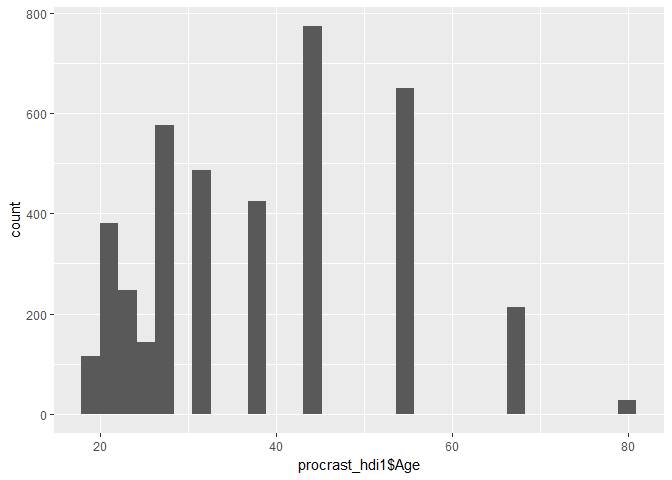
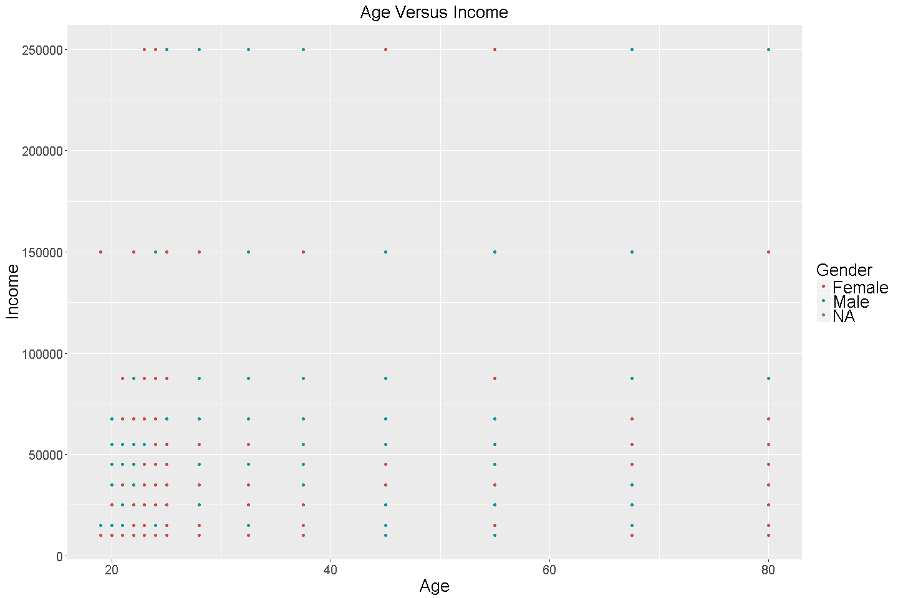
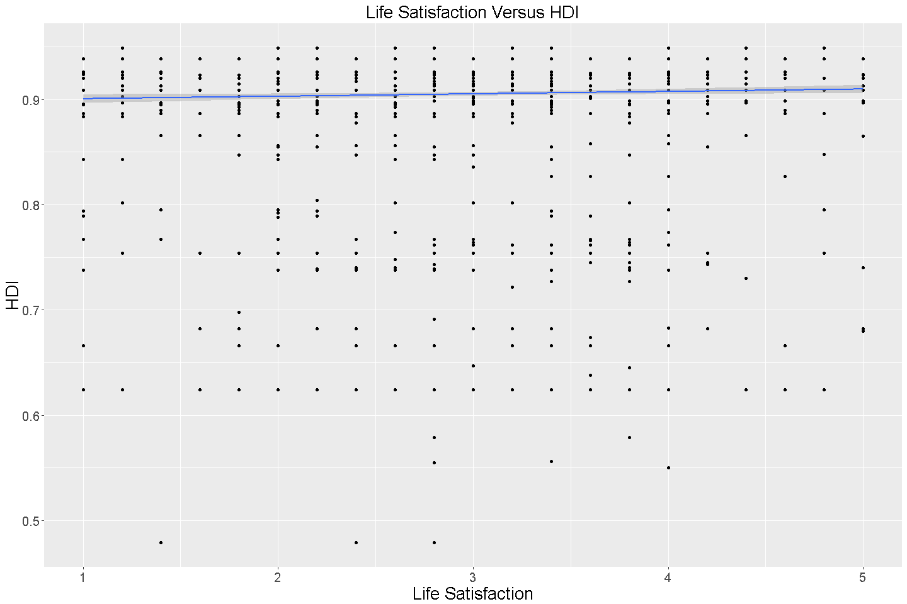
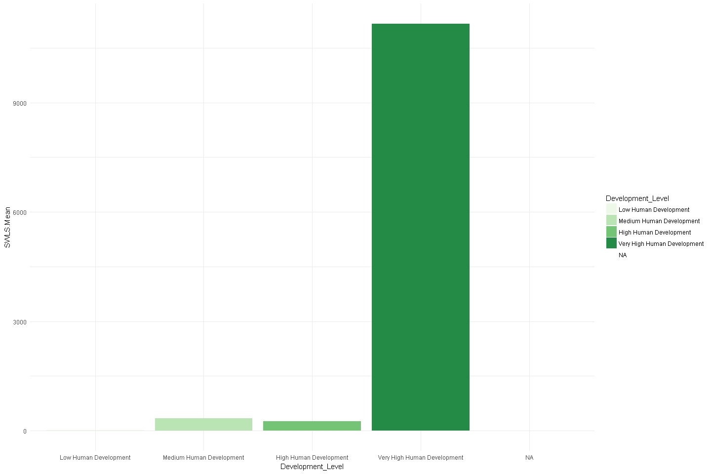

# Procrastination
Arturo Casillas & Eric McCandless  
November 26, 2017  


## Introduction

Background: 

##Sources/Data

Data files: Raw and URL/Scraped
 * Procrastination data


```r
library(knitr)
library(xml2)
library(rvest)
library(ggplot2)
library(pander)
#opts_knit$set(root.dir = "~/Documents/")
#getwd()
```

Procrastination data imported and cleaned


Import the data. It has 4,264 observations and 61 variables:


```r
# #2.
# #read the data
# #This assumes that CaseStudy2 is your working directory
# #2.a.
procrastination<-read.csv('./Data/Procrastination.csv', header=TRUE, na.strings=c(""," ","NA"))
#read_chunk('./Analysis/procrastination_data.R')

#2.a.
#dimensions
dim(procrastination)
```

```
## [1] 4264   61
```

Dimensions:
 * Initial dimensions are 4264 observations and 61 variables


Clean data variable by variable:

 * Go through variables one by one
  * Rename if necessary to keep 12 characters and under
  * the '.' is used as a separator
  * Define appropriate missing values: '0' when numeric and blank when character
   * Use 2.c.iii.-iv. as examples  
   -For example, work status has a '0' instead of 'full-time' or 'retired'. This was changed to a missing value
  * Fix when factor labels are not applied correctly
   * Use 2.c.ii. as example
   - Sons has 'Male' and 'Female' instead of 1 and 2
  * Decide what to do with nonsense data
   * Use 2.c.i. as example


```r
#2.b.-2.c.

### Clean data by variable ###

#rename levels or change values

names(procrastination)[1]<-'Age'

names(procrastination)[4]<-'Education'

#names(procrastination)[5]<-'Work.Status'
levels(procrastination$Work.Status)[match('0', levels(procrastination$Work.Status))]<-NA #''

names(procrastination)[6]<-'Income.Year'
#tail(sort(procrastination$Income.Year), 150)
#Consider that the incomes are buckets not values
#unique(procrastination$Income.Year)

names(procrastination)[7]<-'Current.Job'
#unique(procrastination$Current.Job)
#check for other info about 's'
#procrastination[procrastination$Current.Job == 's',]
levels(procrastination$Current.Job)[match('na', levels(procrastination$Current.Job))]<-NA
levels(procrastination$Current.Job)[match('0', levels(procrastination$Current.Job))]<-NA

#Fix Misspellings
#ouh could be oxford university hospital was not changed
levels(procrastination$Current.Job)[match('s', levels(procrastination$Current.Job))]<-'student'
levels(procrastination$Current.Job)[match('Studey', levels(procrastination$Current.Job))]<-'student'
levels(procrastination$Current.Job)[match('psychologis', levels(procrastination$Current.Job))]<-'psychologist'
levels(procrastination$Current.Job)[match('mktg', levels(procrastination$Current.Job))]<-'Marketing'
levels(procrastination$Current.Job)[match('MD', levels(procrastination$Current.Job))]<-'Physician'
levels(procrastination$Current.Job)[match('Economy', levels(procrastination$Current.Job))]<-'Economist'
levels(procrastination$Current.Job)[match('vidoe', levels(procrastination$Current.Job))]<-'video'
levels(procrastination$Current.Job)[match(' houswife', levels(procrastination$Current.Job))]<-'Housewife'
#gsub('â???"', '', levels(procrastination$Current.Job))
levels(procrastination$Current.Job)[match('\'Utterly shiftless arts student\'... at p', levels(procrastination$Current.Job))]<-'student'
levels(procrastination$Current.Job)[match('asst', levels(procrastination$Current.Job))]<-'Assistant'

names(procrastination)[8]<-'Years.Empl.'
#tail(sort(procrastination$Years.Empl.), 50)
#999 years is missing since we don't know what it means
procrastination$Years.Empl.<-ifelse(procrastination$Years.Empl. == 999, NA, procrastination$Years.Empl.)
procrastination$Years.Empl.<-round(procrastination$Years.Empl)

names(procrastination)[9]<-'Months.Empl.'

names(procrastination)[10]<-'Comm.Size'
#CHeck if 8 or 0 corresponds to a category if numeric
#procrastination$Comm.Size[as.numeric(procrastination$Comm.Size) == 8]
#procrastination$Comm.Size[as.numeric(procrastination$Comm.Size) == 0]
#Change to 'Small City based on other responses
levels(procrastination$Comm.Size)[match('8', levels(procrastination$Comm.Size))]<-'Small City'
levels(procrastination$Comm.Size)[match('0', levels(procrastination$Comm.Size))]<-NA

names(procrastination)[11]<-'Country'
levels(procrastination$Country)[match('0', levels(procrastination$Country))]<-NA
levels(procrastination$Country)[match('', levels(procrastination$Country))]<-NA
#levels(procrastination$Country)[match(' ', levels(procrastination$Country))]<-'<NA>'

names(procrastination)[12]<-'Marital.Stat'
levels(procrastination$Marital.Stat)[match('0', levels(procrastination$Marital.Stat))]<-NA

names(procrastination)[13]<-'Sons'
levels(procrastination$Sons)[match('Male', levels(procrastination$Sons))]<-'1'
levels(procrastination$Sons)[match('Female', levels(procrastination$Sons))]<-'2'
#Convert to numeric
procrastination$Sons = as.numeric(as.character(procrastination$Sons))

names(procrastination)[14]<-'Daughters'
#procrastination$Daughters = as.numeric(procrastination$Daughters)

names(procrastination)[15]<-'XDP1'
names(procrastination)[16]<-'XDP2'
names(procrastination)[17]<-'XDP3'
names(procrastination)[18]<-'XDP4'
names(procrastination)[19]<-'XDP5'
names(procrastination)[20]<-'XAIP1'
names(procrastination)[21]<-'XAIP2'
names(procrastination)[22]<-'XAIP3'
names(procrastination)[23]<-'XAIP4'
names(procrastination)[24]<-'XAIP5'
names(procrastination)[25]<-'XAIP6'
names(procrastination)[26]<-'XAIP7'
names(procrastination)[27]<-'XAIP8'
names(procrastination)[28]<-'XAIP9'
names(procrastination)[29]<-'XAIP10'
names(procrastination)[30]<-'XAIP11'
names(procrastination)[31]<-'XAIP12'
names(procrastination)[32]<-'XAIP13'
names(procrastination)[33]<-'XAIP14'
names(procrastination)[34]<-'XAIP15'
names(procrastination)[35]<-'XGP1'
names(procrastination)[36]<-'XGP2'
names(procrastination)[37]<-'XGP3'
names(procrastination)[38]<-'XGP4'
names(procrastination)[39]<-'XGP5'
names(procrastination)[40]<-'XGP6'
names(procrastination)[41]<-'XGP7'
names(procrastination)[42]<-'XGP8'
names(procrastination)[43]<-'XGP9'
names(procrastination)[44]<-'XGP10'
names(procrastination)[45]<-'XGP11'
names(procrastination)[46]<-'XGP12'
names(procrastination)[47]<-'XGP13'
names(procrastination)[48]<-'XGP14'
names(procrastination)[49]<-'XGP15'
names(procrastination)[50]<-'XGP16'
names(procrastination)[51]<-'XGP17'
names(procrastination)[52]<-'XGP18'
names(procrastination)[53]<-'XGP19'
names(procrastination)[54]<-'XGP20'
names(procrastination)[55]<-'SWLS1'
names(procrastination)[56]<-'SWLS2'
names(procrastination)[57]<-'SWLS3'
names(procrastination)[58]<-'SWLS4'
names(procrastination)[59]<-'SWLS5'

names(procrastination)[60]<-'Self.Assess'

names(procrastination)[61]<-'Other.Assess'
#Check if '4' or '0' correspond to a categor under numeric coding
#procrastination$Other.Assess[as.numeric(procrastination$Other.Assess) == 4]
#procrastination$Other.Assess[as.numeric(procrastination$Other.Assess) == 0]
levels(procrastination$Other.Assess)[match('4', levels(procrastination$Other.Assess))]<-'no'
levels(procrastination$Other.Assess)[match('0', levels(procrastination$Other.Assess))]<-NA
```


Create Procrastination means
 * These are the mean procrastination scores per individual per category


```r
#2.e.
#Create means for category of survey questions
#First, find the indexes of the survey category in question
#Then, use apply() to find the row mean only for those categories

XGP<-grep( 'XGP', names(procrastination))
procrastination$XGP.Mean<-apply(procrastination[,XGP], 1, mean, na.rm=TRUE)

XDP<-grep( 'XDP', names(procrastination))
procrastination$XDP.Mean<-apply(procrastination[,XDP], 1, mean, na.rm=TRUE)

XAIP<-grep( 'XAIP', names(procrastination))
procrastination$XAIP.Mean<-apply(procrastination[,XAIP], 1, mean, na.rm=TRUE)

SWLS<-grep( 'SWLS', names(procrastination))
procrastination$SWLS.Mean<-apply(procrastination[,SWLS], 1, mean, na.rm=TRUE)
```

Double Check


HDI_Data Scraped and cleaned
 * Scrape HDI data and save to repository


```r
#Access tables on website and save and clean each of the 8 tables.

hdi_url <- ("https://en.wikipedia.org/wiki/List_of_countries_by_Human_Development_Index#Complete_list_of_countries")

hdi1 <- hdi_url %>%
  html() %>%
  html_nodes('table') %>%
  .[[3]] %>%
  html_table(fill=TRUE)
hdi1 <- hdi1[,-c(1:2),]
hdi1 <- hdi1[,-c(3:273),]
hdi1 <- hdi1[-c(1:3),]
colnames(hdi1) <- c("Country","HDI")
hdi1 <- hdi1[-c(27:28),]

hdi2 <- hdi_url %>%
  html() %>%
  html_nodes('table') %>%
  .[[6]] %>%
  html_table(fill=TRUE)
hdi2 <- hdi2[,-c(1:2),]
hdi2 <- hdi2[,-c(3:298),]
hdi2 <- hdi2[-c(1:3),]
colnames(hdi2) <- c("Country","HDI")
hdi2 <- hdi2[-c(29:30),]

hdi3 <- hdi_url %>%
  html() %>%
  html_nodes('table') %>%
  .[[9]] %>%
  html_table(fill=TRUE)
hdi3 <- hdi3[,-c(1:2),]
hdi3 <- hdi3[,-c(3:223),]
hdi3 <- hdi3[-c(1:3),]
colnames(hdi3) <- c("Country","HDI")
hdi3 <- hdi3[-c(21:22),]

hdi4 <- hdi_url %>%
  html() %>%
  html_nodes('table') %>%
  .[[12]] %>%
  html_table(fill=TRUE)
hdi4 <- hdi4[,-c(1:2),]
hdi4 <- hdi4[,-c(3:223),]
hdi4 <- hdi4[-c(1:3),]
colnames(hdi4) <- c("Country","HDI")
hdi4 <- hdi4[-c(22:23),]

#Bind tables and convert HDI to numeric for analysis.

hdi_total <- rbind(hdi1, hdi2, hdi3, hdi4)
hdi_total$HDI <- as.numeric(hdi_total$HDI)

#Create HDI category column and assign category to each country.

hdi_total$Development_Level <- cut(hdi_total$HDI, 
                       breaks = c(-Inf, .550, .701, .800, Inf), 
                       labels = c("Low Human Development", "Medium Human Development", "High Human Development", "Very High Human Development"),
                       right = FALSE)

#saved file "hdi.csv" to Data file in repo:
#write.csv(hdi_total, "C:/Users/emccandless/Documents/SMU/CaseStudy2/Data/hdi.csv", row.names=FALSE)
```

Merge the two datasets
 * Prepare to merge by Country / align spellings
 * Merge Procrastination and HDI_Data by Country
 * Use merged table for analysis


```r
############## MERGE THE TWO DATASESTS ################

#3.c.
#THis requires both 'procrasintation' and 'hdi_total' from previous codes

#Check Spellings
#sort(unique(procrastination$Country))
#sort(unique(hdi_total$Country))

#Use Spanish Spelling of COlumbia
levels(procrastination$Country)[match('Columbia', levels(procrastination$Country))]<-'Colombia'
#Use correct Spelling of Israel
levels(procrastination$Country)[match('Isreal', levels(procrastination$Country))]<-'Israel'

procrast_hdi<-merge(x=procrastination, y=hdi_total, by.x='Country', by.y='Country', all.x = TRUE)

##Check results
#summary(test$procrast_hdi)
#str(procrast_hdi)

#unique(procrast_hdi$Country[is.na(procrast_hdi$HDI)])
##No HDI for Antiqua, Bermuda, Guam, Macao, Puerto Rico, and former Yogoslavia

#Summary of missing values
#Ta<-table(procrast_hdi$Country[is.na(procrast_hdi$HDI)])
#Ta[Ta > 0]
```

##Additional Information

Additional information about this assessment can be found in the README file in the repository.

##Analysis/Findings

Removed age outliers <18 per clients request. (Q4a)


```r
#Removed respondents age<18.
procrast_hdi1 <- procrast_hdi[procrast_hdi$Age>18,]
```

Descriptive Statistics - Age, Income, HDI, 4 Mean Scores (Q4b)


```r
#Summary stats for key variables.
procrast_hdi2 <- apply(procrast_hdi1[,c('Age','Income.Year', 'HDI', 'XGP.Mean', 'XDP.Mean', 'XAIP.Mean', 'SWLS.Mean')], 2, summary)
kable(procrast_hdi2)
```

                Age   Income.Year           HDI   XGP.Mean    XDP.Mean   XAIP.Mean   SWLS.Mean
--------  ---------  ------------  ------------  ---------  ----------  ----------  ----------
Min.       19.00000      10000.00     0.4790000    1.00000    1.000000    1.000000    1.000000
1st Qu.    28.00000      15000.00     0.9200000    2.80000    2.400000    2.400000    2.400000
Median     37.50000      45000.00     0.9200000    3.25000    3.000000    2.933333    3.000000
Mean       38.28382      59879.87     0.9054367    3.23947    3.051635    2.963859    3.046779
3rd Qu.    45.00000      87500.00     0.9200000    3.75000    3.800000    3.533333    3.800000
Max.       80.00000     250000.00     0.9490000    5.00000    5.000000    5.000000    5.000000
NA's       71.00000        486.00   242.0000000   71.00000   71.000000   71.000000   71.000000

Histogram for Age (Q4b)

Histogram shows most respondents age 18+ from the study are under 50, however, there is a large segment age 50-60. 


```r
#histogram to show distribution of respondent age.

ggplot(procrast_hdi1, aes(procrast_hdi1$Age)) +
  geom_histogram() +
  xlab("Age") 
```

<!-- -->

Histogram for Income (Q4b)

Histogram shows most respondents from the study have income below 100K, however, there is a large segment with income of 150K. 


```r
#histogram to show distribution of respondent income.
ggplot(procrast_hdi1, aes(procrast_hdi1$Income.Year)) +
  geom_histogram() +
  xlab("Income") 
```

<!-- -->

Participants by Gender (Q4c)

Counts of how many participants there were by gender in decending order.  There were 70 observations without a gender value.  These observations were removed from the list prior to creating the table.


```r
#table that shows counts/percentages.
procrast_hdi3 <- table(procrast_hdi1$Gender)
procrast_hdi11 <- data.frame(cbind(procrast_hdi3, prop.table(procrast_hdi3)))
#procrast_hdi11 = procrast_hdi11[-1,]
names(procrast_hdi11) <- c("Count", "Percentage")
procrast_hdi11$Percentage <- round(procrast_hdi11$Percentage * 100, digits=2)
procrast_hdi12 <- data.frame(procrast_hdi11)
procrast_hdi12 <- procrast_hdi12[order(-procrast_hdi12$Percentage), ,drop = FALSE]
procrast_hdi12 <- cbind(Gender=rownames(procrast_hdi12), procrast_hdi12)
rownames(procrast_hdi12) <- 1:nrow(procrast_hdi12) 
knitr::kable(procrast_hdi12)
```


Gender    Count   Percentage
-------  ------  -----------
Female     2309         57.3
Male       1721         42.7

Participants by Work Status (Q4c)

Counts of how many participants there were by work status in decending order.  There were 113 observations without a work status value.  These observations were removed from the list prior to creating the table.


```r
#table that shows counts/percentages.
procrast_hdi4 <- table(procrast_hdi1$Work.Status)
procrast_hdi11 <- data.frame(cbind(procrast_hdi4, prop.table(procrast_hdi4)))
procrast_hdi11 = procrast_hdi11[-1,]
names(procrast_hdi11) <- c("Count", "Percentage")
procrast_hdi11$Percentage <- round(procrast_hdi11$Percentage * 100, digits=2)
procrast_hdi12 <- data.frame(procrast_hdi11)
procrast_hdi12 <- procrast_hdi12[order(-procrast_hdi12$Percentage), ,drop = FALSE]
procrast_hdi12 <- cbind(WorkStatus=rownames(procrast_hdi12), procrast_hdi12)
rownames(procrast_hdi12) <- 1:nrow(procrast_hdi12) 
knitr::kable(procrast_hdi12)
```


WorkStatus    Count   Percentage
-----------  ------  -----------
student         837        20.96
part-time       465        11.64
unemployed      258         6.46
retired         174         4.36

Participants by Occupation (Q4c)


```r
## We find this more useful than table()
## A different analyst can use table() or a different function ahead
EMTABLE<-function(df, var1 = 'Variable', digits = 1){
  
 # df<-procrast_hdi1$Gender
 # digits = 1
 # var1 = 'Variable'

  procrast_hdi10 <- table(df)
  #Convert to data.frame
  procrast_hdi11 <- data.frame(cbind(procrast_hdi10, prop.table(procrast_hdi10)))
  #Tidy Count and Percentage
  names(procrast_hdi11) <- c("Count", "Percentage")
  procrast_hdi11$Percentage <- round(procrast_hdi11$Percentage * 100, digits=digits)
  #Descending order
  procrast_hdi11 <- procrast_hdi11[order(-procrast_hdi11$Percentage), ,drop = FALSE]
  #Row.Names as column
  procrast_hdi12 <- cbind(rownames(procrast_hdi11), procrast_hdi11)
  names(procrast_hdi12)[1] = var1
  rownames(procrast_hdi12) <- 1:nrow(procrast_hdi12)  
  
  #This outputs this table to our preferred format
  return(procrast_hdi12)

}
```


```r
#4.c.
## These are frequency tables for three key variables

#First, table for gender
Gend.Table<-EMTABLE(procrast_hdi1$Gender, digits=1, var1 = 'Gender')
Gend.Table
```

```
##   Gender Count Percentage
## 1 Female  2309       57.3
## 2   Male  1721       42.7
```


```r
#4.c.
#Then, table for work status
WorkStat.Table<-EMTABLE(procrast_hdi1$Work.Status, digits=1, var1 = 'Work Status')
kable(WorkStat.Table)
```


Work Status    Count   Percentage
------------  ------  -----------
full-time       2260         56.6
student          837         21.0
part-time        465         11.6
unemployed       258          6.5
retired          174          4.4

Current Occupation Q4c

Shown here are the twenty largest counts of how many participants there were by current occupation in decending order of frequency.  There were 2654 observations without an occupation value.  These observations were removed from the list prior to creating the table. Given that this was a write in response, there are a large number of unique responses. A full list of all of responses can be found in the repository.


```r
#4.c.
#Then, table for Job Table
JobTable<-EMTABLE(procrast_hdi1$Current.Job, digits=1, var1 = 'Current Occupation')
kable(JobTable[1:20,])
```


Current Occupation    Count   Percentage
-------------------  ------  -----------
please specify          200         12.7
teacher                  74          4.7
college professor        43          2.7
engineer                 32          2.0
manager                  32          2.0
Attorney                 30          1.9
retired                  28          1.8
Editor                   21          1.3
Marketing                21          1.3
attorney                 19          1.2
writer                   19          1.2
Unemployed               18          1.1
Housewife                16          1.0
Doctor; Physician        16          1.0
Software Developer       16          1.0
consultant               12          0.8
Nurse                    13          0.8
Scientist                12          0.8
Financial Advisor        11          0.7
home maker               11          0.7

```r
####EXPORT
#write.csv(JobTable, file='~/Data/Current_Job_Freq.csv')
```


```r
#4.d.
#Top 15 countries among our respondents
Country.Table<-EMTABLE(procrast_hdi1$Country, digits=1, var1 = 'Country')
kable(Country.Table[1:15,])
```


Country           Count   Percentage
---------------  ------  -----------
United States      2785         71.9
Canada              243          6.3
United Kingdom      177          4.6
Australia            99          2.6
India                78          2.0
Italy                62          1.6
Germany              36          0.9
Brazil               20          0.5
Ireland              19          0.5
Israel               19          0.5
Netherlands          18          0.5
Norway               14          0.4
Sweden               15          0.4
China                12          0.3
Finland              12          0.3

```r
#Note: NA or no response accounted for 231 participants, putting it in 4th place
```


```r
#4.e.
#
Match.Assess <- data.frame('Match.Assess'<-paste(procrast_hdi1$Self.Assess , procrast_hdi1$Other.Assess, sep = "|"))
MatchTable<-EMTABLE(Match.Assess, digits=1, var1 = 'Assessment: Self | Others')
kable(MatchTable)
```


Assessment: Self | Others    Count   Percentage
--------------------------  ------  -----------
yes|yes                       2358         57.4
yes|no                        1107         27.0
no|no                          483         11.8
NA|NA                           78          1.9
no|yes                          51          1.2
yes|NA                          25          0.6
no|NA                            4          0.1
NA|no                            1          0.0

???????????????????????????????????????????????????????

Participants by Country (Q4d)

Counts of how many participants there were by country in decending order.  There were 231 observations without a country name.  These observations were removed from the list prior to creating the table.


```r
#table that shows counts/percentages.
procrast_hdi5 <- table(procrast_hdi1$Country)
procrast_hdi11 <- data.frame(cbind(procrast_hdi5, prop.table(procrast_hdi5)))
procrast_hdi11 = procrast_hdi11[-1,]
names(procrast_hdi11) <- c("Count", "Percentage")
procrast_hdi11$Percentage <- round(procrast_hdi11$Percentage * 100, digits=2)
procrast_hdi12 <- data.frame(procrast_hdi11)
#sorting
procrast_hdi12 <- procrast_hdi12[order(-procrast_hdi12$Percentage), ,drop = FALSE]
procrast_hdi12 <- cbind(Country=rownames(procrast_hdi12), procrast_hdi12)
rownames(procrast_hdi12) <- 1:nrow(procrast_hdi12) 
knitr::kable(procrast_hdi12)
```


Country               Count   Percentage
-------------------  ------  -----------
United States          2785        71.85
Canada                  243         6.27
United Kingdom          177         4.57
Australia                99         2.55
India                    78         2.01
Italy                    62         1.60
Germany                  36         0.93
Brazil                   20         0.52
Ireland                  19         0.49
Israel                   19         0.49
Netherlands              18         0.46
Sweden                   15         0.39
Norway                   14         0.36
France                   13         0.34
Japan                    13         0.34
Spain                    13         0.34
China                    12         0.31
Finland                  12         0.31
Mexico                   12         0.31
New Zealand              12         0.31
South Africa             12         0.31
Switzerland              12         0.31
Philippines              11         0.28
Greece                   10         0.26
Belgium                   9         0.23
Denmark                   9         0.23
Turkey                    9         0.23
Hong Kong                 7         0.18
Portugal                  7         0.18
Slovenia                  6         0.15
Poland                    5         0.13
Romania                   5         0.13
Chile                     4         0.10
Croatia                   4         0.10
Malaysia                  4         0.10
Singapore                 4         0.10
Algeria                   3         0.08
Argentina                 3         0.08
Austria                   3         0.08
Czech Republic            3         0.08
Ecuador                   3         0.08
Puerto Rico               3         0.08
Uruguay                   3         0.08
Albania                   2         0.05
Andorra                   2         0.05
Bermuda                   2         0.05
Bulgaria                  2         0.05
Colombia                  2         0.05
Ghana                     2         0.05
Iran                      2         0.05
Malta                     2         0.05
Peru                      2         0.05
Saudi Arabia              2         0.05
South Korea               2         0.05
Thailand                  2         0.05
Ukraine                   2         0.05
Venezuela                 2         0.05
Yugoslavia                2         0.05
Antigua                   1         0.03
Bahamas                   1         0.03
Barbados                  1         0.03
Bolivia                   1         0.03
Botswana                  1         0.03
Brunei                    1         0.03
Cyprus                    1         0.03
Dominican Republic        1         0.03
Egypt                     1         0.03
El Salvador               1         0.03
Guam                      1         0.03
Guyana                    1         0.03
Hungary                   1         0.03
Iceland                   1         0.03
Jamaica                   1         0.03
Kazakhstan                1         0.03
Kenya                     1         0.03
Lithuania                 1         0.03
Luxembourg                1         0.03
Macao                     1         0.03
Macedonia                 1         0.03
Morocco                   1         0.03
Myanmar                   1         0.03
Nicaragua                 1         0.03
Pakistan                  1         0.03
Panama                    1         0.03
Qatar                     1         0.03
Russia                    1         0.03
Sri Lanka                 1         0.03
Taiwan                    1         0.03
Vietnam                   1         0.03
Estonia                   0         0.00
Lebanon                   0         0.00

Perceptions of Procrastination (Q4e)

Data show that 2,841 respondents' perception of whether or not they are a procrastinator matched what others think.  This equates to 69% of the respondent base.


```r
#table that shows counts/percentages by combo of responses.
Vector <- data.frame('Match.Assess'<-paste(procrast_hdi1$Self.Assess , procrast_hdi1$Other.Assess, sep = "|"))
procrast_hdi6 <- table(Vector)
procrast_hdi11 <- data.frame(cbind(procrast_hdi6, prop.table(procrast_hdi6)))
names(procrast_hdi11) <- c("Count", "Percentage")
procrast_hdi11$Percentage <- round(procrast_hdi11$Percentage * 100, digits=2)
procrast_hdi12 <- data.frame(procrast_hdi11)
procrast_hdi12 <- procrast_hdi12[order(-procrast_hdi12$Percentage), ,drop = FALSE]
procrast_hdi12 <- cbind(Procrastination=rownames(procrast_hdi12), procrast_hdi12)
rownames(procrast_hdi12) <- 1:nrow(procrast_hdi12) 
knitr::kable(procrast_hdi12)
```


Procrastination    Count   Percentage
----------------  ------  -----------
yes|yes             2358        57.41
yes|no              1107        26.95
no|no                483        11.76
NA|NA                 78         1.90
no|yes                51         1.24
yes|NA                25         0.61
no|NA                  4         0.10
NA|no                  1         0.02

Top 15 Nations According to the Decisional Procrastination Scale - DP (Q5b)


```r
#table that summarizes DP means by country.
DP_Mean <- procrast_hdi1[,c("Country", "XDP.Mean")]
DP_Mean <- aggregate(DP_Mean[, c("XDP.Mean")], list(DP_Mean$Country), mean)
colnames(DP_Mean) <- c("Country", "XDP.Mean")

#second table that shows development level by country.
DP_Mean1 <- procrast_hdi1[,c("Country","Development_Level")]
DP_Mean1 <- unique(DP_Mean1)

#merging 2 tables to get DP and development category together in df.
DP_Meanfinal <- merge(DP_Mean, DP_Mean1, by=c("Country"))
DP_Meanfinal = DP_Meanfinal[-1,]
DP_Meanfinal <- DP_Meanfinal[order(-DP_Meanfinal$XDP.Mean), ,drop = FALSE]
DP_Meanfinal <- head(DP_Meanfinal,15)
DP_Meanfinal$XDP.Mean <- round(DP_Meanfinal$XDP.Mean, digits=1)
DP_Meanfinal$Development_Level <- as.character(DP_Meanfinal$Development_Level)
DP_Meanfinal$Development_Level[is.na(DP_Meanfinal$Development_Level)] <- "No Development Level Reported"


#creating bar plot.
ggplot(DP_Meanfinal, aes(x=reorder(Country,XDP.Mean),y=XDP.Mean)) +
  geom_bar(stat="identity", aes(fill=Development_Level)) +
  ggtitle("Top 15 Nations in Average DP Procrastination Scores") +
  theme(plot.title = element_text(hjust = 0.5, size=20), axis.text=element_text(size=15), axis.title=element_text(size=20), legend.title=element_text(size=20), legend.text=element_text(size=15)) +
  xlab("Country") +
  ylab("DP") +
  geom_text(aes(label = XDP.Mean), hjust=-.25, size=5) +
  scale_fill_brewer(palette="Dark2") +
  coord_flip()
```

<!-- -->

Top 15 Nations According to the General Procrastination Scale - GP (Q5c)

Data show that 9 countries show up in the top 15 in both the DP and GP scale.  The countries are Slovania, Taiwan, Puerto Rico, Qatar, Panama, Sri Lanka, Austria, Ecuador, and Uruguay.


```r
#merging 2 tables to get GP and development category together in df.
DP_Mean <- procrast_hdi1[,c("Country", "XGP.Mean")]
DP_Mean <- aggregate(DP_Mean[, c("XGP.Mean")], list(DP_Mean$Country), mean)
colnames(DP_Mean) <- c("Country", "XGP.Mean")
#second table that shows development level by country.
DP_Mean1 <- procrast_hdi1[,c("Country","Development_Level")]
DP_Mean1 <- unique(DP_Mean1)
#merging 2 tables to get DP and development category together in df.
DP_Meanfinal <- merge(DP_Mean, DP_Mean1, by=c("Country"))
DP_Meanfinal = DP_Meanfinal[-1,]
DP_Meanfinal <- DP_Meanfinal[order(-DP_Meanfinal$XGP.Mean), ,drop = FALSE]
DP_Meanfinal <- head(DP_Meanfinal,15)
DP_Meanfinal$XGP.Mean <- round(DP_Meanfinal$XGP.Mean, digits=1)
DP_Meanfinal$Development_Level <- as.character(DP_Meanfinal$Development_Level)
DP_Meanfinal$Development_Level[is.na(DP_Meanfinal$Development_Level)] <- "No Development Level Reported"
#creating bar plot.
ggplot(DP_Meanfinal, aes(x=reorder(Country,XGP.Mean),y=XGP.Mean)) +
  geom_bar(stat="identity", aes(fill=Development_Level)) +
  ggtitle("Top 15 Nations in Average GP Procrastination Scores") +
  theme(plot.title = element_text(hjust = 0.5, size=20), axis.text=element_text(size=15), axis.title=element_text(size=20), legend.title=element_text(size=20), legend.text=element_text(size=15)) +
  xlab("Country") +
  ylab("GP") +
  geom_text(aes(label = XGP.Mean), hjust=-.25, size=5) +
  scale_fill_brewer(palette="Dark2") +
  coord_flip()
```

<!-- -->

Relationship Between Age and Income (Q5d)

?????????????????????????????????????????????????


```r
#creating scatterplot.
ggplot(procrast_hdi1, aes(x=Age, y=Income.Year, color=Gender)) +
  geom_point() +
  scale_colour_hue(l=50)+
  ggtitle("Age Versus Income") +
  theme(plot.title = element_text(hjust = 0.5, size=20), axis.text=element_text(size=15), axis.title=element_text(size=20), legend.title=element_text(size=20), legend.text=element_text(size=20)) +
  xlab("Age") +
  ylab("Income") 
```

<!-- -->

Relationship Between Life Satisfaction and HDI (Q5e)

According to the scatterplot, there appears to be no relationship between mean Life Satsisfaciton and HDI. 


```r
#creating scatterplot.
ggplot(procrast_hdi1, aes(x=SWLS.Mean, y=HDI)) +
  geom_point() + geom_smooth(method=lm) +
  scale_colour_hue(l=50)+
  ggtitle("Life Satisfaction Versus HDI") +
  theme(plot.title = element_text(hjust = 0.5, size=20), axis.text=element_text(size=15), axis.title=element_text(size=20), legend.title=element_text(size=20), legend.text=element_text(size=20)) +
  xlab("Life Satisfaction") +
  ylab("HDI") 
```

<!-- -->

Relationship Between Life Satisfaction and HDI (Development Level) (Q5e)

?????????????????????????????????????????????????


```r
#creating scatterplot.
  ggplot(procrast_hdi1, aes(y=SWLS.Mean, x=Development_Level, fill=Development_Level)) + theme_minimal() +
  geom_bar(stat="identity") + 
  scale_fill_brewer(palette="Greens") #+
```

<!-- -->

```r
#  scale_colour_hue(l=50) 
#   ggtitle("Life Satisfaction Versus HDI") +
#   theme(plot.title = element_text(hjust = 0.5, size=20), axis.text=element_text(size=15), axis.title=element_text(size=20), legend.title=element_text(size=20), legend.text=element_text(size=20)) +
#   xlab("Life Satisfaction") +
#   ylab("HDI Development Level") 
```

Data Output

The finalized HDI table can be found in the Data folder in repository (hdi.csv). (Q6a)

The Tidied version of the original data and merged HDI data... (Q6b)

Dataset (or two) that shows the Top 15 nations... (Q6c)

d All output should be in plain English or translated in the Codebook. (Q6d)


Highlights:


###Modifications/Merges to Data

###Data Summary

##Conclusions


