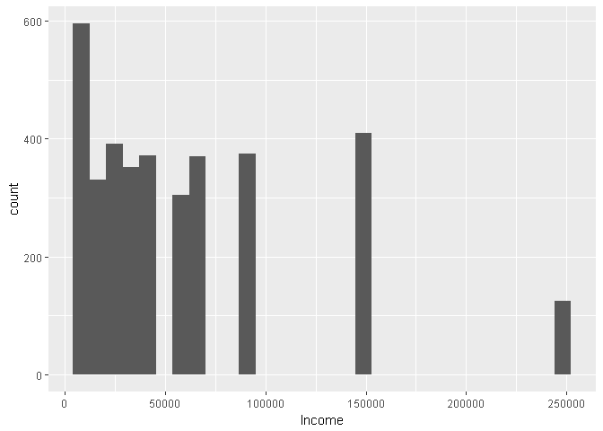

# Procrastination
Arturo Casillas & Eric McCandless  
November 26, 2017  


## Introduction

Background: 

##Sources/Data

Data files: Raw and URL/Scraped
 * Procrastination data


```r
library(knitr)
library(xml2)
library(rvest)
library(pander)
#opts_knit$set(root.dir = "~/Documents/")
#getwd()
```

Procrastination data imported and cleaned


Import the data. It has 4,264 observations and 61 variables:


```r
# #2.
# #read the data
# #This assumes that CaseStudy2 is your working directory
# #2.a.
procrastination<-read.csv('./Data/Procrastination.csv', header=TRUE)
#read_chunk('./Analysis/procrastination_data.R')

#2.a.
#dimensions
dim(procrastination)
```

```
## [1] 4264   61
```

Dimensions:
 * Initial dimensions are 4264 observations and 61 variables

<-!First Look:


```r
#general info
str(procrastination)

#Create 'catch', a vector of boolean if-numeric
catch=NA
for(i in 1:length(procrastination[1,])){catch<-c(catch, is.numeric(procrastination[,i]))}
#catch[-1]

#Numeric Summary
apply(procrastination[,catch[-1]], 2, summary)

#Character Summary
apply(procrastination[,!catch[-1]], 2, unique)
```

Clean data variable by variable:

 * Go through variables one by one
  * Rename if necessary to keep 12 characters and under
  * the '.' is used as a separator
  * Define appropriate missing values: '0' when numeric and blank when character
   * Use 2.c.iii.-iv. as examples  
   -For example, work status has a '0' instead of 'full-time' or 'retired'. This was changed to a missing value
  * Fix when factor labels are not applied correctly
   * Use 2.c.ii. as example
   - Sons has 'Male' and 'Female' instead of 1 and 2
  * Decide what to do with nonsense data
   * Use 2.c.i. as example


```r
#2.b.-2.c.

### Clean data by variable ###

#rename levels or change values

names(procrastination)[1]<-'Age'

names(procrastination)[4]<-'Education'

#names(procrastination)[5]<-'Work.Status'
levels(procrastination$Work.Status)[match('0', levels(procrastination$Work.Status))]<-NA #''

names(procrastination)[6]<-'Income.Year'
#tail(sort(procrastination$Income.Year), 150)
#Consider that the incomes are buckets not values
#unique(procrastination$Income.Year)

names(procrastination)[7]<-'Current.Job'
#unique(procrastination$Current.Job)
#check for other info about 's'
#procrastination[procrastination$Current.Job == 's',]
levels(procrastination$Current.Job)[match('na', levels(procrastination$Current.Job))]<-NA
levels(procrastination$Current.Job)[match('0', levels(procrastination$Current.Job))]<-NA

#Fix Misspellings
#ouh could be oxford university hospital was not changed
levels(procrastination$Current.Job)[match('s', levels(procrastination$Current.Job))]<-'student'
levels(procrastination$Current.Job)[match('Studey', levels(procrastination$Current.Job))]<-'student'
levels(procrastination$Current.Job)[match('psychologis', levels(procrastination$Current.Job))]<-'psychologist'
levels(procrastination$Current.Job)[match('mktg', levels(procrastination$Current.Job))]<-'Marketing'
levels(procrastination$Current.Job)[match('MD', levels(procrastination$Current.Job))]<-'Physician'
levels(procrastination$Current.Job)[match('Economy', levels(procrastination$Current.Job))]<-'Economist'
levels(procrastination$Current.Job)[match('vidoe', levels(procrastination$Current.Job))]<-'video'
levels(procrastination$Current.Job)[match('houswife', levels(procrastination$Current.Job))]<-'Housewife'
gsub('â???"', '', levels(procrastination$Current.Job))
```

```
##   [1] ""                                          
##   [2] "'Utterly shiftless arts student'... at p"  
##   [3] " Accountant"                               
##   [4] " acupuncturist"                            
##   [5] " admin assist"                             
##   [6] " anthropologist"                           
##   [7] " Assistant"                                
##   [8] " Attorney-self employed"                   
##   [9] " bookseller"                               
##  [10] " Communications"                           
##  [11] " consultant"                               
##  [12] " designer"                                 
##  [13] " Diplomat"                                 
##  [14] " Epidemiologist"                           
##  [15] " houswife"                                 
##  [16] " innkeeper"                                
##  [17] " Military"                                 
##  [18] " Research/Teaching Assistant"              
##  [19] " school"                                   
##  [20] " specialist"                               
##  [21] " teacher"                                  
##  [22] " Teaching Assistant/Graduate student"      
##  [23] " university faculty"                       
##  [24] " veterinarian"                             
##  [25] "abc"                                       
##  [26] "Academic"                                  
##  [27] "Academic Assistant"                        
##  [28] "academic/career coach & admin assistant"   
##  [29] "Account Manager"                           
##  [30] "account planner"                           
##  [31] "Account Service Rep"                       
##  [32] "Accounting"                                
##  [33] "Accounting Assistant"                      
##  [34] "Accounting Manager"                        
##  [35] "Accounts Payable"                          
##  [36] "Accounts Payable / Fleet Manager"          
##  [37] "acounting analyst"                         
##  [38] "Activities Leader"                         
##  [39] "Actress"                                   
##  [40] "adjunct faculty / University + communit"   
##  [41] "Administration Assistant"                  
##  [42] "Administrative Asistant for Jewelry Stor"  
##  [43] "Administrative Officer"                    
##  [44] "Administrator"                             
##  [45] "adult care"                                
##  [46] "advocate"                                  
##  [47] "Agronomist"                                
##  [48] "airline"                                   
##  [49] "airport ground handler"                    
##  [50] "analyst"                                   
##  [51] "Analyst"                                   
##  [52] "Antique Dealer"                            
##  [53] "Architect"                                 
##  [54] "Art Director"                              
##  [55] "Artist"                                    
##  [56] "Artist/ designer/builder"                  
##  [57] "Artist/administrator"                      
##  [58] "artist/designer/homemaker"                 
##  [59] "Assistant District Attorney"               
##  [60] "assistant general counsel"                 
##  [61] "assistant professor"                       
##  [62] "Assistant Professor"                       
##  [63] "Assoc. Governmental Program Analyst"       
##  [64] "associate"                                 
##  [65] "Associate / investment banking"            
##  [66] "associate at law firm"                     
##  [67] "Associate Director"                        
##  [68] "Associate director/ marketing communicat"  
##  [69] "Associate Producer"                        
##  [70] "asst"                                      
##  [71] "Asst. Pre-school Teacher"                  
##  [72] "Asst. Prof."                               
##  [73] "Astrohysicist"                             
##  [74] "attorney"                                  
##  [75] "Attorney"                                  
##  [76] "Attorney - self employed for 2 years â<U+0080><U+0093> f"
##  [77] "Attorney â<U+0080><U+0093> Associate"                    
##  [78] "audio engineer"                            
##  [79] "Aviation Specialist"                       
##  [80] "Bank Teller"                               
##  [81] "banker"                                    
##  [82] "Bar & Restaurant Owner"                    
##  [83] "Bartender"                                 
##  [84] "Biologist"                                 
##  [85] "bookkeeper"                                
##  [86] "bookkeeper/ actor"                         
##  [87] "Box Office Representative"                 
##  [88] "Braillist"                                 
##  [89] "Budget analyst"                            
##  [90] "business"                                  
##  [91] "Business / Test Analyst"                   
##  [92] "BUSINESS CONSULTA"                         
##  [93] "business consultant"                       
##  [94] "business manager"                          
##  [95] "Business Owner"                            
##  [96] "Business Systems Analyst"                  
##  [97] "businesswoman"                             
##  [98] "buyer"                                     
##  [99] "C E O/ M D"                                
## [100] "CAD operator"                              
## [101] "CAD Technician"                            
## [102] "Camera Coordinator"                        
## [103] "Campus Planner"                            
## [104] "Capstone Golf Course"                      
## [105] "Career Placement Associate"                
## [106] "Case Manager"                              
## [107] "Casting Director"                          
## [108] "cataloguer /  freelance artist"            
## [109] "catholic priest/ full timestudent"         
## [110] "ceo"                                       
## [111] "Certified Nurse's Assistant"               
## [112] "chairman of the board"                     
## [113] "chauffeur"                                 
## [114] "Chief Financial Officer"                   
## [115] "Chief of Staff"                            
## [116] "Chiefe Development Engineer"               
## [117] "chiropractor"                              
## [118] "civil servant"                             
## [119] "Civil servant"                             
## [120] "clerk"                                     
## [121] "Client Relationship Assistant"             
## [122] "Clinical Dietitian"                        
## [123] "clinical psychologist"                     
## [124] "Clinical Research Assistant"               
## [125] "Clinical Trial Assistant"                  
## [126] "Clutter clearer,  video editor, caterer"   
## [127] "Co-Proprietor"                             
## [128] "Collection management specialist"          
## [129] "College Administrator"                     
## [130] "college faculty"                           
## [131] "college professor"                         
## [132] "Communications & Publishing"               
## [133] "company director"                          
## [134] "Computer Consultant"                       
## [135] "Computer Instructor (Continuing Educatio"  
## [136] "Computer Operator"                         
## [137] "Computer Programmer"                       
## [138] "Computer Science"                          
## [139] "Computer Systems Analyst"                  
## [140] "Computers"                                 
## [141] "Consultant and entrepreneur (small busin"  
## [142] "Consulting Manager"                        
## [143] "Consumer Case Coordinator"                 
## [144] "Controller"                                
## [145] "Contsuruction Management"                  
## [146] "Coordinator of International Programs"     
## [147] "coordinatore operativo"                    
## [148] "copy supervisor"                           
## [149] "Copy Writer"                               
## [150] "Corporate instructor"                      
## [151] "Corporate Trainer"                         
## [152] "Corporation President"                     
## [153] "Corrections"                               
## [154] "Counselor"                                 
## [155] "Country Style Employee"                    
## [156] "Creative Consultant"                       
## [157] "Creative Director"                         
## [158] "CRNA"                                      
## [159] "Customer Service"                          
## [160] "Customer Service at Domino's Pizza"        
## [161] "Dance teacher"                             
## [162] "Data Warehouse Engineer"                   
## [163] "Dealer"                                    
## [164] "Dental & Disability Coordinator"           
## [165] "dentist"                                   
## [166] "Dept. Director (Non-profit)"               
## [167] "Deputy Chief of Public Information for t"  
## [168] "Deputy Chieif Information Officer"         
## [169] "Deputy Director"                           
## [170] "deputy practice manager"                   
## [171] "Designer"                                  
## [172] "detail checker"                            
## [173] "Developer"                                 
## [174] "Dietitian"                                 
## [175] "director"                                  
## [176] "Director / information technology"         
## [177] "Director of a language program"            
## [178] "Director of Academic Affairs"              
## [179] "Director of business development"          
## [180] "Director of Contract Management"           
## [181] "Director of non-profit organization"       
## [182] "Director of Software Company"              
## [183] "Director Operations"                       
## [184] "Director,social Dvelopment"                
## [185] "Disability Allowance"                      
## [186] "Dish Washer"                               
## [187] "Divisional Manager of a large cosmetics"   
## [188] "Doctor Research"                           
## [189] "Doctor; Physician"                         
## [190] "Doctoral Candidate!!!  no wonder i'm doi"  
## [191] "Driver"                                    
## [192] "Early child hood teacher"                  
## [193] "Early Childhood Education Student/ Nanny"  
## [194] "Ecology technician"                        
## [195] "Economist"                                 
## [196] "Editor"                                    
## [197] "Editor Attorney"                           
## [198] "education"                                 
## [199] "Education (at a university)"               
## [200] "education administration"                  
## [201] "Education Specialist"                      
## [202] "Educator/Student"                          
## [203] "EFL Teacher/ Professional Researcher"      
## [204] "EHS Manager"                               
## [205] "election services"                         
## [206] "Electrical Technician"                     
## [207] "electronic technician"                     
## [208] "employed by a church"                      
## [209] "EMT"                                       
## [210] "energy therapist"                          
## [211] "engineer"                                  
## [212] "enologist"                                 
## [213] "entertainer"                               
## [214] "entrepreneur"                              
## [215] "Entrepreneur & Consultant"                 
## [216] "Environmental Analyst"                     
## [217] "environmental education non profit direc"  
## [218] "Environmental Engineer"                    
## [219] "Environmental Senior Specialist"           
## [220] "EOD"                                       
## [221] "ESL Teacher/Biologist"                     
## [222] "Executive"                                 
## [223] "Executive Assistant"                       
## [224] "Executive Director"                        
## [225] "Executive officer"                         
## [226] "Executive Vice President / Senior Lender"  
## [227] "Facilitator"                               
## [228] "Facilities Management"                     
## [229] "Farm Manager"                              
## [230] "fdsdf"                                     
## [231] "federal excise tax auditor"                
## [232] "Field Coordinator"                         
## [233] "film editor"                               
## [234] "Film Industry/Miscelanious"                
## [235] "Film maker"                                
## [236] "Finance"                                   
## [237] "Financial Advisor"                         
## [238] "financial analyst"                         
## [239] "Financial Analyst"                         
## [240] "Financial Consultant"                      
## [241] "Financial Controller"                      
## [242] "financial officer / small career-trainin"  
## [243] "financial risk manager"                    
## [244] "First VP & Associate General Counsel"      
## [245] "Fitness Assistant / wellness mentor / ca"  
## [246] "Fitness Instructor"                        
## [247] "flight surgeon"                            
## [248] "Food Department Director"                  
## [249] "Food Service Supervisor"                   
## [250] "Foreign Affairs Specialist"                
## [251] "Framer/Sales Associate"                    
## [252] "free lance bookkeeper"                     
## [253] "Free lance editor and tutor--in theory"    
## [254] "free professionist"                        
## [255] "Freelance"                                 
## [256] "Freelance ESL Teacher"                     
## [257] "Freelance musician / part time EMT / pri"  
## [258] "Freelance Project Manager"                 
## [259] "Full-Time Mother / Part-Time Editor"       
## [260] "full time student and part time bartende"  
## [261] "fulltime office assistant"                 
## [262] "furniture maker, home restorer"            
## [263] "Gender/Public Health Consultant"           
## [264] "Geologist"                                 
## [265] "Geophysicist"                              
## [266] "Gove service"                              
## [267] "Graduate Assistant"                        
## [268] "Graduate Research Assistant"               
## [269] "Graduate Researcher"                       
## [270] "Graduate student--research and teaching"   
## [271] "Graduate student/University instructor"    
## [272] "Grants Administrator"                      
## [273] "Graphic Designer"                          
## [274] "Grease Monkey"                             
## [275] "Grocery Store Salesman"                    
## [276] "Groundskeeper"                             
## [277] "Head - Operations & QA"                    
## [278] "health care"                               
## [279] "Healthcare Consultant"                     
## [280] "home maker"                                
## [281] "host"                                      
## [282] "hostess"                                   
## [283] "Hotel Desk Clerk"                          
## [284] "Housekeeping"                              
## [285] "HR generalist"                             
## [286] "Human Resource Manager"                    
## [287] "Human Resource Manger"                     
## [288] "HVAC Tech"                                 
## [289] "ICT Director"                              
## [290] "In-house Legal Counsel"                    
## [291] "information assisstant"                    
## [292] "Information Developer"                     
## [293] "Information Management"                    
## [294] "Information technology"                    
## [295] "Information Technology Consultant"         
## [296] "Instructional Assistant Online"            
## [297] "instructor / coach"                        
## [298] "Insurance"                                 
## [299] "insurance agent"                           
## [300] "Insurance Agent"                           
## [301] "insurance broker's assistant"              
## [302] "Insurance Claims Supervisor"               
## [303] "Insurance Coordinator"                     
## [304] "intern"                                    
## [305] "Internet & media consultant"               
## [306] "Internship"                                
## [307] "interpreter"                               
## [308] "Investigative Specialist"                  
## [309] "Investment Assistant"                      
## [310] "investment banker"                         
## [311] "Investment Counsel"                        
## [312] "ISTraining Coordinator"                    
## [313] "IT"                                        
## [314] "IT admin"                                  
## [315] "IT Administrator"                          
## [316] "IT analyst"                                
## [317] "IT Assistant"                              
## [318] "IT consultant"                             
## [319] "IT Consultant"                             
## [320] "IT director"                               
## [321] "IT Director"                               
## [322] "IT Engineer"                               
## [323] "IT Manager"                                
## [324] "IT security consultant"                    
## [325] "IT Specialist"                             
## [326] "IT Support"                                
## [327] "IT Support Engineer"                       
## [328] "IT systems administrator"                  
## [329] "IT Technician"                             
## [330] "Janitor"                                   
## [331] "jewelry artist"                            
## [332] "Journalist"                                
## [333] "journalist (freelance)"                    
## [334] "Juvenile Corrections Officer"              
## [335] "Lab Director/Archeologist"                 
## [336] "Lab Services Assistant"                    
## [337] "Labor Relations Specialist"                
## [338] "laboratory technician"                     
## [339] "laborer (construction)"                    
## [340] "land use planner"                          
## [341] "landscape designer"                        
## [342] "Language Service Provider"                 
## [343] "language trainer"                          
## [344] "Law clerk"                                 
## [345] "law enforcement"                           
## [346] "lecturer"                                  
## [347] "Legal Assistant"                           
## [348] "Legal Assistant / Office Manager"          
## [349] "Legal Secretary"                           
## [350] "Legislation Analyst"                       
## [351] "letter carrier"                            
## [352] "Librarian"                                 
## [353] "Library Assistant"                         
## [354] "library paraprofessional"                  
## [355] "Library technician"                        
## [356] "Licensed Professional Counselor"           
## [357] "Life Guard"                                
## [358] "Lift Ops"                                  
## [359] "LPN"                                       
## [360] "maintenance tech."                         
## [361] "Management consultant"                     
## [362] "Management Consultant & Entrepreneur"      
## [363] "manager"                                   
## [364] "Manager - Analytical and Environmental S"  
## [365] "manager IT"                                
## [366] "Manager,Interacitve Media"                 
## [367] "manufacturing"                             
## [368] "Market Analyst"                            
## [369] "Market Research Analyst"                   
## [370] "Marketing"                                 
## [371] "marketing copywriter"                      
## [372] "Massage Therapist"                         
## [373] "Master Control Operator"                   
## [374] "md"                                        
## [375] "Mechanical Engineer"                       
## [376] "Media Consultant"                          
## [377] "Media Relations Manager"                   
## [378] "media relations/science writing"           
## [379] "Medical"                                   
## [380] "Medical / Public Health Educator"          
## [381] "Medical Laboratory"                        
## [382] "Medical Practitioner"                      
## [383] "medical sonographer"                       
## [384] "medical transcriptionist"                  
## [385] "Mentor/Special Events intern"              
## [386] "Mover"                                     
## [387] "Multimedia Developer"                      
## [388] "museum docent"                             
## [389] "Musician"                                  
## [390] "musician/student/teacher"                  
## [391] "Nanny"                                     
## [392] "Nanny and student"                         
## [393] "Network Engineer"                          
## [394] "Network Services Engineer"                 
## [395] "new realtor"                               
## [396] "newspaper carrier"                         
## [397] "Night Dispatch Supervisor  (it's just a"   
## [398] "Non-profit Consultant"                     
## [399] "Nurse"                                     
## [400] "nursing home"                              
## [401] "office"                                    
## [402] "Office Admin"                              
## [403] "Office Manager"                            
## [404] "Office Manager / Accountant"               
## [405] "Office Services Manager"                   
## [406] "Online Media Buyer"                        
## [407] "operations manager"                        
## [408] "Organic Grocery Store Cashier/shift lead"  
## [409] "Ornithology Graduate Student and Teachin"  
## [410] "ouh"                                       
## [411] "Outdoor Recreation Coordinator"            
## [412] "Owner"                                     
## [413] "owner - private practice physical therap"  
## [414] "P-T College Faculty & P-T Self-Employed"   
## [415] "Page Designer for a newspaper"             
## [416] "Paralegal"                                 
## [417] "Paraprofessional"                          
## [418] "Parent Educator/Supervisor"                
## [419] "Partner"                                   
## [420] "Pastor ; Life coach  clergy"               
## [421] "pathology"                                 
## [422] "PCA"                                       
## [423] "PCA for a quadrapilegic and a PCA for a"   
## [424] "Pharmaceutical Merchandiser"               
## [425] "Pharmacist"                                
## [426] "pharmacy tech."                            
## [427] "phd student researcher"                    
## [428] "photo profucer"                            
## [429] "Physical Science Technician"               
## [430] "physician (internist)"                     
## [431] "Physicist"                                 
## [432] "Physiotherapst"                            
## [433] "pjublic relations director"                
## [434] "Plant Engineering Supervisor"              
## [435] "please specify"                            
## [436] "Please specify title Manager for Regulat"  
## [437] "policy analyst"                            
## [438] "Post Grad Physician"                       
## [439] "Postdoc"                                   
## [440] "Postdoctoral Researcher"                   
## [441] "pr and communications firm owner"          
## [442] "President"                                 
## [443] "President Nongovernmental organization"    
## [444] "president/CEO"                             
## [445] "Press Officer"                             
## [446] "Private Equity Principal"                  
## [447] "pro poker player /   website owner"        
## [448] "Probation Supervisor"                      
## [449] "Process Engineer"                          
## [450] "Procrastinator"                            
## [451] "Produce Associate"                         
## [452] "producer"                                  
## [453] "Product Field Test Manager"                
## [454] "Production Operations Support Analyst"     
## [455] "Professional Organizer"                    
## [456] "Professional Soccer Player"                
## [457] "Program Assistant"                         
## [458] "Program Coordinator"                       
## [459] "Program Director"                          
## [460] "Program director at a non-profit organiz"  
## [461] "Program Manager"                           
## [462] "Program Manager and Acting Director"       
## [463] "Program officer"                           
## [464] "Program Specialist"                        
## [465] "Programmer"                                
## [466] "Programmer Analyst"                        
## [467] "Programmer/Developer"                      
## [468] "Programmer/Software Analyst"               
## [469] "project manager"                           
## [470] "Project Manager"                           
## [471] "Proofreader"                               
## [472] "Proposal Director"                         
## [473] "Psychiatrist in Private Practice"          
## [474] "psychologist"                              
## [475] "psychotherapist"                           
## [476] "Public Health"                             
## [477] "public relations"                          
## [478] "Publishing"                                
## [479] "quad racer"                                
## [480] "Quality Manager"                           
## [481] "Quotations specialist"                     
## [482] "real estate"                               
## [483] "real estate agent"                         
## [484] "Real Estate Appraiser"                     
## [485] "real estate broker"                        
## [486] "Real estate developer"                     
## [487] "realtor"                                   
## [488] "Reasearch assistant"                       
## [489] "Receptionist"                              
## [490] "Recreational Staff"                        
## [491] "Regional Sales Manager"                    
## [492] "Registered Respiratory Therapist"          
## [493] "regulatory affairs"                        
## [494] "Research / GIS analyst"                    
## [495] "Research Analyst"                          
## [496] "Research Assistant"                        
## [497] "Research Associate"                        
## [498] "research coordinator"                      
## [499] "Research intern"                           
## [500] "Research manager"                          
## [501] "Research Scholar"                          
## [502] "Research Scientist"                        
## [503] "research specialist"                       
## [504] "research technician"                       
## [505] "researcher"                                
## [506] "Researcher - Physician"                    
## [507] "Residence Don"                             
## [508] "resident physician"                        
## [509] "Residential Services Supervisor"           
## [510] "Respiratory Therapist"                     
## [511] "restaurant mgr / student / and looking f"  
## [512] "Restaurant operations manager"             
## [513] "Retail"                                    
## [514] "Retail / artist /writer"                   
## [515] "retired"                                   
## [516] "retired/adjunct"                           
## [517] "RN"                                        
## [518] "RN - Medical Sales"                        
## [519] "rocket scientist"                          
## [520] "student"                                   
## [521] "Sales"                                     
## [522] "Sales executive"                           
## [523] "Sales Expert"                              
## [524] "sales insurance"                           
## [525] "sales manager"                             
## [526] "Sales Rep"                                 
## [527] "Sales/ daycare worker"                     
## [528] "School Counselor"                          
## [529] "Science writing intern"                    
## [530] "Scientist"                                 
## [531] "secretary"                                 
## [532] "Secretary"                                 
## [533] "Self-Employed / personal trainer / stren"  
## [534] "Self-employed Family Therapist"            
## [535] "self-employed freelance writer/author"     
## [536] "self-employed Photographer"                
## [537] "self-employed translator"                  
## [538] "Self-employed writer/editor"               
## [539] "self employed"                             
## [540] "Self Employed"                             
## [541] "Self employed Public Relations"            
## [542] "self employeed"                            
## [543] "selfemplyed renovator"                     
## [544] "Senate Page"                               
## [545] "senior consultant"                         
## [546] "Senior Consultant Programmer/Analyst"      
## [547] "Senior Grant Officer"                      
## [548] "Senior Human Resources Consultant"         
## [549] "Senior Policy Advisor"                     
## [550] "senior project manager"                    
## [551] "Senior Records Analyst"                    
## [552] "Senior Staff Writer"                       
## [553] "Senior Systems Analyst"                    
## [554] "Server"                                    
## [555] "Service co-ordinator"                      
## [556] "Service Registrar/English Instructor"      
## [557] "set designer"                              
## [558] "set lighting technician"                   
## [559] "Shipping/receiving/warehouse mgnt"         
## [560] "Social Media consultant"                   
## [561] "Social Policy Analyst"                     
## [562] "Social Work Intern"                        
## [563] "Social Worker"                             
## [564] "Software analyst"                          
## [565] "Software Developer"                        
## [566] "Software engineer"                         
## [567] "Software Pro"                              
## [568] "Software Sales"                            
## [569] "Software trainer"                          
## [570] "Speaker Author Consultant"                 
## [571] "Speaker/Actor"                             
## [572] "Special Education Administrative Assista"  
## [573] "special education teacher"                 
## [574] "Special Projects Editor"                   
## [575] "Speech and language Assistant"             
## [576] "Sr. Drug Safety Associate"                 
## [577] "Staff Writer at a magazine"                
## [578] "Statistician"                              
## [579] "Stay-at-home dad"                          
## [580] "steamship agent"                           
## [581] "stocker"                                   
## [582] "Student / working part-time"               
## [583] "Student and Administrative Assistant"      
## [584] "Student and part time secretary"           
## [585] "Student and Private Curator"               
## [586] "student childhood and youth studies"       
## [587] "student fysiotherapy /home care / massage" 
## [588] "Student part-time and sales full-time"     
## [589] "student/barmaid"                           
## [590] "student/imvestor"                          
## [591] "student/retail"                            
## [592] "Student/Teacher"                           
## [593] "student/waiter"                            
## [594] "supervising program development speciali"  
## [595] "Supervisor"                                
## [596] "supervisor shelderd workshop for handcap"  
## [597] "Surgeon"                                   
## [598] "Surgical Resident"                         
## [599] "System Analyst"                            
## [600] "system manager"                            
## [601] "Systems Analyst"                           
## [602] "Systems Programmer/Analyst"                
## [603] "tax consultant"                            
## [604] "Tax Examiner"                              
## [605] "teacher's assistant/afterschool leader"    
## [606] "teacher / Administrator"                   
## [607] "Teacher and Full Time Doctoral Student"    
## [608] "Teacher assistant"                         
## [609] "Tech Analyst/GIS"                          
## [610] "Tech Support"                              
## [611] "Technical Coordinator"                     
## [612] "Technical director"                        
## [613] "Technical officer"                         
## [614] "Technical support rep"                     
## [615] "Technical Trainer"                         
## [616] "technical writer"                          
## [617] "Technical Writer"                          
## [618] "Technology (CTO)"                          
## [619] "Technology Curriculum Developer Science"   
## [620] "Telemarketer"                              
## [621] "television director"                       
## [622] "Television Producer"                       
## [623] "Temp"                                      
## [624] "temporary office"                          
## [625] "Test Item Writer (Self-employed)"          
## [626] "Theater artist/ Teacher"                   
## [627] "Theater General Manager"                   
## [628] "Tour Guide"                                
## [629] "Town Clerk"                                
## [630] "Town Planner"                              
## [631] "trader"                                    
## [632] "Traffic Reporter-Radio"                    
## [633] "trainee"                                   
## [634] "training Coordinator"                      
## [635] "Training Coordinator"                      
## [636] "Translator"                                
## [637] "treatment support co-ordinator"            
## [638] "Tutor"                                     
## [639] "TV BROADCAST TECHNICIAN"                   
## [640] "TV News Executive Producer"                
## [641] "Unemployed"                                
## [642] "University Staff"                          
## [643] "Urban Planner/Economic Development Plann"  
## [644] "Vetrans Representative"                    
## [645] "vice-president"                            
## [646] "vice president"                            
## [647] "Vice President / program office"           
## [648] "video"                                     
## [649] "visual artist"                             
## [650] "VMD"                                       
## [651] "Volunteer Director"                        
## [652] "volunteer mental health worker"            
## [653] "VP Scientific Affairs / pharmaceutical c"  
## [654] "warehouse"                                 
## [655] "Warehouse Supervisor"                      
## [656] "Web Communications"                        
## [657] "Web Designer"                              
## [658] "Webmaster / Print Designer"                
## [659] "wig designer"                              
## [660] "writer"                                    
## [661] "Writer & Director of Content Solutions"    
## [662] "Writer / eductor"                          
## [663] "writer / lecturer / consultant"            
## [664] "Writer / web designer/ web-master"         
## [665] "Writer and management consultant"          
## [666] "writer/editor"                             
## [667] "Writer/editor/musician"                    
## [668] "writer/musician"                           
## [669] "Writing Consultant"                        
## [670] "yoga teacher"
```

```r
levels(procrastination$Current.Job)[match('\'Utterly shiftless arts student\'... at p', levels(procrastination$Current.Job))]<-'student'
levels(procrastination$Current.Job)[match('asst', levels(procrastination$Current.Job))]<-'Assistant'

names(procrastination)[8]<-'Years.Empl.'
#tail(sort(procrastination$Years.Empl.), 50)
#999 years is missing since we don't know what it means
procrastination$Years.Empl.<-ifelse(procrastination$Years.Empl. == 999, NA, procrastination$Years.Empl.)
procrastination$Years.Empl.<-round(procrastination$Years.Empl)

names(procrastination)[9]<-'Months.Empl.'

names(procrastination)[10]<-'Comm.Size'
#CHeck if 8 or 0 corresponds to a category if numeric
#procrastination$Comm.Size[as.numeric(procrastination$Comm.Size) == 8]
#procrastination$Comm.Size[as.numeric(procrastination$Comm.Size) == 0]
#Change to 'Small City based on other responses
levels(procrastination$Comm.Size)[match('8', levels(procrastination$Comm.Size))]<-'Small City'
levels(procrastination$Comm.Size)[match('0', levels(procrastination$Comm.Size))]<-NA

names(procrastination)[11]<-'Country'
levels(procrastination$Country)[match('0', levels(procrastination$Country))]<-NA
levels(procrastination$Country)[match('', levels(procrastination$Country))]<-NA
#levels(procrastination$Country)[match(' ', levels(procrastination$Country))]<-'<NA>'

names(procrastination)[12]<-'Marital.Stat'
levels(procrastination$Marital.Stat)[match('0', levels(procrastination$Marital.Stat))]<-NA

names(procrastination)[13]<-'Sons'
levels(procrastination$Sons)[match('Male', levels(procrastination$Sons))]<-'1'
levels(procrastination$Sons)[match('Female', levels(procrastination$Sons))]<-'2'
#Convert to numeric
procrastination$Sons = as.numeric(as.character(procrastination$Sons))

names(procrastination)[14]<-'Daughters'
#procrastination$Daughters = as.numeric(procrastination$Daughters)

names(procrastination)[15]<-'XDP1'
names(procrastination)[16]<-'XDP2'
names(procrastination)[17]<-'XDP3'
names(procrastination)[18]<-'XDP4'
names(procrastination)[19]<-'XDP5'
names(procrastination)[20]<-'XAIP1'
names(procrastination)[21]<-'XAIP2'
names(procrastination)[22]<-'XAIP3'
names(procrastination)[23]<-'XAIP4'
names(procrastination)[24]<-'XAIP5'
names(procrastination)[25]<-'XAIP6'
names(procrastination)[26]<-'XAIP7'
names(procrastination)[27]<-'XAIP8'
names(procrastination)[28]<-'XAIP9'
names(procrastination)[29]<-'XAIP10'
names(procrastination)[30]<-'XAIP11'
names(procrastination)[31]<-'XAIP12'
names(procrastination)[32]<-'XAIP13'
names(procrastination)[33]<-'XAIP14'
names(procrastination)[34]<-'XAIP15'
names(procrastination)[35]<-'XGP1'
names(procrastination)[36]<-'XGP2'
names(procrastination)[37]<-'XGP3'
names(procrastination)[38]<-'XGP4'
names(procrastination)[39]<-'XGP5'
names(procrastination)[40]<-'XGP6'
names(procrastination)[41]<-'XGP7'
names(procrastination)[42]<-'XGP8'
names(procrastination)[43]<-'XGP9'
names(procrastination)[44]<-'XGP10'
names(procrastination)[45]<-'XGP11'
names(procrastination)[46]<-'XGP12'
names(procrastination)[47]<-'XGP13'
names(procrastination)[48]<-'XGP14'
names(procrastination)[49]<-'XGP15'
names(procrastination)[50]<-'XGP16'
names(procrastination)[51]<-'XGP17'
names(procrastination)[52]<-'XGP18'
names(procrastination)[53]<-'XGP19'
names(procrastination)[54]<-'XGP20'
names(procrastination)[55]<-'SWLS1'
names(procrastination)[56]<-'SWLS2'
names(procrastination)[57]<-'SWLS3'
names(procrastination)[58]<-'SWLS4'
names(procrastination)[59]<-'SWLS5'

names(procrastination)[60]<-'Self.Assess'

names(procrastination)[61]<-'Other.Assess'
#Check if '4' or '0' correspond to a categor under numeric coding
#procrastination$Other.Assess[as.numeric(procrastination$Other.Assess) == 4]
#procrastination$Other.Assess[as.numeric(procrastination$Other.Assess) == 0]
levels(procrastination$Other.Assess)[match('4', levels(procrastination$Other.Assess))]<-'no'
levels(procrastination$Other.Assess)[match('0', levels(procrastination$Other.Assess))]<-NA
```


Create Procrastination means
 * These are the mean procrastination scores per individual per category


```r
#2.e.
#Create means for category of survey questions
#First, find the indexes of the survey category in question
#Then, use apply() to find the row mean only for those categories

XGP<-grep( 'XGP', names(procrastination))
procrastination$XGP.Mean<-apply(procrastination[,XGP], 1, mean, na.rm=TRUE)

XDP<-grep( 'XDP', names(procrastination))
procrastination$XDP.Mean<-apply(procrastination[,XDP], 1, mean, na.rm=TRUE)

XAIP<-grep( 'XAIP', names(procrastination))
procrastination$XAIP.Mean<-apply(procrastination[,XAIP], 1, mean, na.rm=TRUE)

SWLS<-grep( 'SWLS', names(procrastination))
procrastination$SWLS.Mean<-apply(procrastination[,SWLS], 1, mean, na.rm=TRUE)
```

Double Check


```r
#Double Check
str(procrastination)

#apply(procrastination, 2, class)
catch=NA
for(i in 1:length(procrastination[1,])){catch<-c(catch, is.numeric(procrastination[,i]))}
#catch[-1]

#Numeric Summary
#apply(procrastination[,c(1,6,8:9, 14:59)], 2, summary)
apply(procrastination[,catch[-1]], 2, summary)

#Character Summary
#apply(procrastination[,-c(1,6,8:9, 14:59)], 2, unique)
apply(procrastination[,!catch[-1]], 2, unique)
```

HDI_Data Scraped and cleaned
 * Scrape HDI data and save to repository


```r
#Access tables on website and save and clean each of the 8 tables.

hdi_url <- ("https://en.wikipedia.org/wiki/List_of_countries_by_Human_Development_Index#Complete_list_of_countries")

hdi1 <- hdi_url %>%
  html() %>%
  html_nodes('table') %>%
  .[[3]] %>%
  html_table(fill=TRUE)
hdi1 <- hdi1[,-c(1:2),]
hdi1 <- hdi1[,-c(3:273),]
hdi1 <- hdi1[-c(1:3),]
colnames(hdi1) <- c("Country","HDI")
hdi1 <- hdi1[-c(27:28),]

hdi2 <- hdi_url %>%
  html() %>%
  html_nodes('table') %>%
  .[[6]] %>%
  html_table(fill=TRUE)
hdi2 <- hdi2[,-c(1:2),]
hdi2 <- hdi2[,-c(3:298),]
hdi2 <- hdi2[-c(1:3),]
colnames(hdi2) <- c("Country","HDI")
hdi2 <- hdi2[-c(29:30),]

hdi3 <- hdi_url %>%
  html() %>%
  html_nodes('table') %>%
  .[[9]] %>%
  html_table(fill=TRUE)
hdi3 <- hdi3[,-c(1:2),]
hdi3 <- hdi3[,-c(3:223),]
hdi3 <- hdi3[-c(1:3),]
colnames(hdi3) <- c("Country","HDI")
hdi3 <- hdi3[-c(21:22),]

hdi4 <- hdi_url %>%
  html() %>%
  html_nodes('table') %>%
  .[[12]] %>%
  html_table(fill=TRUE)
hdi4 <- hdi4[,-c(1:2),]
hdi4 <- hdi4[,-c(3:223),]
hdi4 <- hdi4[-c(1:3),]
colnames(hdi4) <- c("Country","HDI")
hdi4 <- hdi4[-c(22:23),]

#Bind tables and convert HDI to numeric for analysis.

hdi_total <- rbind(hdi1, hdi2, hdi3, hdi4)
hdi_total$HDI <- as.numeric(hdi_total$HDI)

#Create HDI category column and assign category to each country.

hdi_total$Development_Level <- cut(hdi_total$HDI, 
                       breaks = c(-Inf, .550, .701, .800, Inf), 
                       labels = c("Low Human Development", "Medium Human Development", "High Human Development", "Very High Human Development"),
                       right = FALSE)

#saved file "hdi.csv" to Data file in repo:
#write.csv(hdi_total, "C:/Users/emccandless/Documents/SMU/CaseStudy2/Data/hdi.csv", row.names=FALSE)
```

Merge the two datasets
 * Prepare to merge by Country / align spellings
 * Merge Procrastination and HDI_Data by Country
 * Use merged table for analysis


```r
############## MERGE THE TWO DATASESTS ################

#3.c.
#THis requires both 'procrasintation' and 'hdi_total' from previous codes

#Check Spellings
#sort(unique(procrastination$Country))
#sort(unique(hdi_total$Country))

#Use Spanish Spelling of COlumbia
levels(procrastination$Country)[match('Columbia', levels(procrastination$Country))]<-'Colombia'
#Use correct Spelling of Israel
levels(procrastination$Country)[match('Isreal', levels(procrastination$Country))]<-'Israel'

procrast_hdi<-merge(x=procrastination, y=hdi_total, by.x='Country', by.y='Country', all.x = TRUE)

##Check results
#summary(test$procrast_hdi)
#str(procrast_hdi)

#unique(procrast_hdi$Country[is.na(procrast_hdi$HDI)])
##No HDI for Antiqua, Bermuda, Guam, Macao, Puerto Rico, and former Yogoslavia

#Summary of missing values
#Ta<-table(procrast_hdi$Country[is.na(procrast_hdi$HDI)])
#Ta[Ta > 0]
```

##Additional Information

Additional information about this assessment can be found in the README file in the repository.

##Analysis/Findings

Removed age outliers <18 per clients request. (Q4a)


```r
#Removed respondents age<18.
procrast_hdi1 <- procrast_hdi[procrast_hdi$Age>18,]
```

Descriptive Statistics - Age, Income, HDI, 4 Mean Scores (Q4b)


```r
#Summary stats for key variables.
procrast_hdi2 <- apply(procrast_hdi1[,c('Age','Income.Year', 'HDI', 'XGP.Mean', 'XDP.Mean', 'XAIP.Mean', 'SWLS.Mean')], 2, summary)
kable(procrast_hdi2)
```

                Age   Income.Year           HDI   XGP.Mean    XDP.Mean   XAIP.Mean   SWLS.Mean
--------  ---------  ------------  ------------  ---------  ----------  ----------  ----------
Min.       19.00000      10000.00     0.4790000    1.00000    1.000000    1.000000    1.000000
1st Qu.    28.00000      15000.00     0.9200000    2.80000    2.400000    2.400000    2.400000
Median     37.50000      45000.00     0.9200000    3.25000    3.000000    2.933333    3.000000
Mean       38.28382      59879.87     0.9054367    3.23947    3.051635    2.963859    3.046779
3rd Qu.    45.00000      87500.00     0.9200000    3.75000    3.800000    3.533333    3.800000
Max.       80.00000     250000.00     0.9490000    5.00000    5.000000    5.000000    5.000000
NA's       71.00000        486.00   242.0000000   71.00000   71.000000   71.000000   71.000000

Histogram for Age (Q4b)

Histogram shows most respondents age 18+ from the study are under 50, however, there is a large segment age 50-60. 


```r
#histogram to show distribution of respondent age.
library(ggplot2)
ggplot(procrast_hdi1, aes(procrast_hdi1$Age)) +
  geom_histogram() +
  xlab("Age") 
```

<!-- -->

Histogram for Income (Q4b)

Histogram shows most respondents from the study have income below 100K, however, there is a large segment with income of 150K. 


```r
#histogram to show distribution of respondent income.
ggplot(procrast_hdi1, aes(procrast_hdi1$Income.Year)) +
  geom_histogram() +
  xlab("Income") 
```

<!-- -->

Participants by Gender (Q4c)

Counts of how many participants there were by gender in decending order.  There were 6 observations without a gender value.  These observations were removed from the list prior to creating the table.


```r
#table that shows counts/percentages.
procrast_hdi3 <- table(procrast_hdi1$Gender)
procrast_hdi11 <- data.frame(cbind(procrast_hdi3, prop.table(procrast_hdi3)))
procrast_hdi11 = procrast_hdi11[-1,]
names(procrast_hdi11) <- c("Count", "Percentage")
procrast_hdi11$Percentage <- round(procrast_hdi11$Percentage * 100, digits=2)
procrast_hdi12 <- data.frame(procrast_hdi11)
procrast_hdi12 <- procrast_hdi12[order(-procrast_hdi12$Percentage), ,drop = FALSE]
procrast_hdi12 <- cbind(Gender=rownames(procrast_hdi12), procrast_hdi12)
rownames(procrast_hdi12) <- 1:nrow(procrast_hdi12) 
knitr::kable(procrast_hdi12)
```


Gender    Count   Percentage
-------  ------  -----------
Female     2309        57.21
Male       1721        42.64

Participants by Work Status (Q4c)

Counts of how many participants there were by work status in decending order.  There were 42 observations without a work status value.  These observations were removed from the list prior to creating the table.


```r
#table that shows counts/percentages.
procrast_hdi4 <- table(procrast_hdi1$Work.Status)
procrast_hdi11 <- data.frame(cbind(procrast_hdi4, prop.table(procrast_hdi4)))
procrast_hdi11 = procrast_hdi11[-1,]
names(procrast_hdi11) <- c("Count", "Percentage")
procrast_hdi11$Percentage <- round(procrast_hdi11$Percentage * 100, digits=2)
procrast_hdi12 <- data.frame(procrast_hdi11)
procrast_hdi12 <- procrast_hdi12[order(-procrast_hdi12$Percentage), ,drop = FALSE]
procrast_hdi12 <- cbind(WorkStatus=rownames(procrast_hdi12), procrast_hdi12)
rownames(procrast_hdi12) <- 1:nrow(procrast_hdi12) 
knitr::kable(procrast_hdi12)
```


WorkStatus    Count   Percentage
-----------  ------  -----------
full-time      2260        56.00
student         837        20.74
part-time       465        11.52
unemployed      258         6.39
retired         174         4.31

Participants by Occupation (Q4c)


```r
## We find this more useful than table()
## A different analyst can use table() or a different function ahead
EMTABLE<-function(df, var1 = 'Variable', digits = 1){
  
 # df<-procrast_hdi1$Gender
 # digits = 1
 # var1 = 'Variable'

  procrast_hdi10 <- table(df)
  #Convert to data.frame
  procrast_hdi11 <- data.frame(cbind(procrast_hdi10, prop.table(procrast_hdi10)))
  #Tidy Count and Percentage
  names(procrast_hdi11) <- c("Count", "Percentage")
  procrast_hdi11$Percentage <- round(procrast_hdi11$Percentage * 100, digits=digits)
  #Descending order
  procrast_hdi11 <- procrast_hdi11[order(-procrast_hdi11$Percentage), ,drop = FALSE]
  #Row.Names as column
  procrast_hdi12 <- cbind(rownames(procrast_hdi11), procrast_hdi11)
  names(procrast_hdi12)[1] = var1
  rownames(procrast_hdi12) <- 1:nrow(procrast_hdi12)  
  
  #This outputs this table to our preferred format
  return(procrast_hdi12)

}
```

20 most frequent occupations


```r
#4.c.
#Then, table for Job Table
JobTable<-EMTABLE(procrast_hdi1$Current.Job, digits=1, var1 = 'Current Occupation')
kable(JobTable[1:20,])
```


Current Occupation     Count   Percentage
--------------------  ------  -----------
                        2045         56.5
please specify           200          5.5
teacher                   74          2.0
college professor         43          1.2
engineer                  32          0.9
manager                   32          0.9
Attorney                  30          0.8
retired                   28          0.8
Editor                    21          0.6
Marketing                 21          0.6
attorney                  19          0.5
Unemployed                18          0.5
writer                    19          0.5
houswife                  16          0.4
Doctor; Physician         16          0.4
Nurse                     13          0.4
Software Developer        16          0.4
consultant                12          0.3
Administrator             10          0.3
assistant professor       10          0.3

???????????????????????????????????????????????????????

Participants by Country (Q4d)

Counts of how many participants there were by country in decending order.  There were 160 observations without a country name.  These observations were removed from the list prior to creating the table.


```r
#table that shows counts/percentages.
procrast_hdi5 <- table(procrast_hdi1$Country)
procrast_hdi11 <- data.frame(cbind(procrast_hdi5, prop.table(procrast_hdi5)))
procrast_hdi11 = procrast_hdi11[-1,]
names(procrast_hdi11) <- c("Count", "Percentage")
procrast_hdi11$Percentage <- round(procrast_hdi11$Percentage * 100, digits=2)
procrast_hdi12 <- data.frame(procrast_hdi11)
#sorting
procrast_hdi12 <- procrast_hdi12[order(-procrast_hdi12$Percentage), ,drop = FALSE]
procrast_hdi12 <- cbind(Country=rownames(procrast_hdi12), procrast_hdi12)
rownames(procrast_hdi12) <- 1:nrow(procrast_hdi12) 
knitr::kable(procrast_hdi12)
```


Country               Count   Percentage
-------------------  ------  -----------
United States          2785        71.85
Canada                  243         6.27
United Kingdom          177         4.57
Australia                99         2.55
India                    78         2.01
Italy                    62         1.60
Germany                  36         0.93
Brazil                   20         0.52
Ireland                  19         0.49
Israel                   19         0.49
Netherlands              18         0.46
Sweden                   15         0.39
Norway                   14         0.36
France                   13         0.34
Japan                    13         0.34
Spain                    13         0.34
China                    12         0.31
Finland                  12         0.31
Mexico                   12         0.31
New Zealand              12         0.31
South Africa             12         0.31
Switzerland              12         0.31
Philippines              11         0.28
Greece                   10         0.26
Belgium                   9         0.23
Denmark                   9         0.23
Turkey                    9         0.23
Hong Kong                 7         0.18
Portugal                  7         0.18
Slovenia                  6         0.15
Poland                    5         0.13
Romania                   5         0.13
Chile                     4         0.10
Croatia                   4         0.10
Malaysia                  4         0.10
Singapore                 4         0.10
Algeria                   3         0.08
Argentina                 3         0.08
Austria                   3         0.08
Czech Republic            3         0.08
Ecuador                   3         0.08
Puerto Rico               3         0.08
Uruguay                   3         0.08
Albania                   2         0.05
Andorra                   2         0.05
Bermuda                   2         0.05
Bulgaria                  2         0.05
Colombia                  2         0.05
Ghana                     2         0.05
Iran                      2         0.05
Malta                     2         0.05
Peru                      2         0.05
Saudi Arabia              2         0.05
South Korea               2         0.05
Thailand                  2         0.05
Ukraine                   2         0.05
Venezuela                 2         0.05
Yugoslavia                2         0.05
Antigua                   1         0.03
Bahamas                   1         0.03
Barbados                  1         0.03
Bolivia                   1         0.03
Botswana                  1         0.03
Brunei                    1         0.03
Cyprus                    1         0.03
Dominican Republic        1         0.03
Egypt                     1         0.03
El Salvador               1         0.03
Guam                      1         0.03
Guyana                    1         0.03
Hungary                   1         0.03
Iceland                   1         0.03
Jamaica                   1         0.03
Kazakhstan                1         0.03
Kenya                     1         0.03
Lithuania                 1         0.03
Luxembourg                1         0.03
Macao                     1         0.03
Macedonia                 1         0.03
Morocco                   1         0.03
Myanmar                   1         0.03
Nicaragua                 1         0.03
Pakistan                  1         0.03
Panama                    1         0.03
Qatar                     1         0.03
Russia                    1         0.03
Sri Lanka                 1         0.03
Taiwan                    1         0.03
Vietnam                   1         0.03
Estonia                   0         0.00
Lebanon                   0         0.00

Perceptions of Procrastination (Q4e)

Data show that 2,841 respondents' perception of whether or not they are a procrastinator matched what others think.  This equates to 69% of the respondent base.


```r
#table that shows counts/percentages by combo of responses.
Vector <- data.frame('Match.Assess'<-paste(procrast_hdi1$Self.Assess , procrast_hdi1$Other.Assess, sep = "|"))
procrast_hdi6 <- table(Vector)
procrast_hdi11 <- data.frame(cbind(procrast_hdi6, prop.table(procrast_hdi6)))
names(procrast_hdi11) <- c("Count", "Percentage")
procrast_hdi11$Percentage <- round(procrast_hdi11$Percentage * 100, digits=2)
procrast_hdi12 <- data.frame(procrast_hdi11)
procrast_hdi12 <- procrast_hdi12[order(-procrast_hdi12$Percentage), ,drop = FALSE]
procrast_hdi12 <- cbind(Procrastination=rownames(procrast_hdi12), procrast_hdi12)
rownames(procrast_hdi12) <- 1:nrow(procrast_hdi12) 
knitr::kable(procrast_hdi12)
```


Procrastination    Count   Percentage
----------------  ------  -----------
yes|yes             2358        57.41
yes|no              1107        26.95
no|no                483        11.76
NA|NA                 71         1.73
no|yes                51         1.24
yes|                  25         0.61
|                      6         0.15
no|                    4         0.10
|NA                    1         0.02
|no                    1         0.02

Top 15 Nations According to the Decisional Procrastination Scale - DP (Q5b)


```r
#table that summarizes DP means by country.
DP_Mean <- procrast_hdi1[,c("Country", "XDP.Mean")]
DP_Mean <- aggregate(DP_Mean[, c("XDP.Mean")], list(DP_Mean$Country), mean)
colnames(DP_Mean) <- c("Country", "XDP.Mean")

#second table that shows development level by country.
DP_Mean1 <- procrast_hdi1[,c("Country","Development_Level")]
DP_Mean1 <- unique(DP_Mean1)

#merging 2 tables to get DP and development category together in df.
DP_Meanfinal <- merge(DP_Mean, DP_Mean1, by=c("Country"))
DP_Meanfinal = DP_Meanfinal[-1,]
DP_Meanfinal <- DP_Meanfinal[order(-DP_Meanfinal$XDP.Mean), ,drop = FALSE]
DP_Meanfinal <- head(DP_Meanfinal,15)
DP_Meanfinal$XDP.Mean <- round(DP_Meanfinal$XDP.Mean, digits=1)
DP_Meanfinal$Development_Level <- as.character(DP_Meanfinal$Development_Level)
DP_Meanfinal$Development_Level[is.na(DP_Meanfinal$Development_Level)] <- "No Development Level Reported"


#creating bar plot.
ggplot(DP_Meanfinal, aes(x=reorder(Country,XDP.Mean),y=XDP.Mean)) +
  geom_bar(stat="identity", aes(fill=Development_Level)) +
  ggtitle("Top 15 Nations in Average DP Procrastination Scores") +
  theme(plot.title = element_text(hjust = 0.5, size=20), axis.text=element_text(size=15), axis.title=element_text(size=20), legend.title=element_text(size=20), legend.text=element_text(size=15)) +
  xlab("Country") +
  ylab("DP") +
  geom_text(aes(label = XDP.Mean), hjust=-.25, size=5) +
  scale_fill_brewer(palette="Dark2") +
  coord_flip()
```

<!-- -->

Top 15 Nations According to the General Procrastination Scale - GP (Q5c)

Data show that 9 countries show up in the top 15 in both the DP and GP scale.  The countries are Slovania, Taiwan, Puerto Rico, Qatar, Panama, Sri Lanka, Austria, Ecuador, and Uruguay.


```r
#merging 2 tables to get GP and development category together in df.
DP_Mean <- procrast_hdi1[,c("Country", "XGP.Mean")]
DP_Mean <- aggregate(DP_Mean[, c("XGP.Mean")], list(DP_Mean$Country), mean)
colnames(DP_Mean) <- c("Country", "XGP.Mean")
#second table that shows development level by country.
DP_Mean1 <- procrast_hdi1[,c("Country","Development_Level")]
DP_Mean1 <- unique(DP_Mean1)
#merging 2 tables to get DP and development category together in df.
DP_Meanfinal <- merge(DP_Mean, DP_Mean1, by=c("Country"))
DP_Meanfinal = DP_Meanfinal[-1,]
DP_Meanfinal <- DP_Meanfinal[order(-DP_Meanfinal$XGP.Mean), ,drop = FALSE]
DP_Meanfinal <- head(DP_Meanfinal,15)
DP_Meanfinal$XGP.Mean <- round(DP_Meanfinal$XGP.Mean, digits=1)
DP_Meanfinal$Development_Level <- as.character(DP_Meanfinal$Development_Level)
DP_Meanfinal$Development_Level[is.na(DP_Meanfinal$Development_Level)] <- "No Development Level Reported"
#creating bar plot.
ggplot(DP_Meanfinal, aes(x=reorder(Country,XGP.Mean),y=XGP.Mean)) +
  geom_bar(stat="identity", aes(fill=Development_Level)) +
  ggtitle("Top 15 Nations in Average GP Procrastination Scores") +
  theme(plot.title = element_text(hjust = 0.5, size=20), axis.text=element_text(size=15), axis.title=element_text(size=20), legend.title=element_text(size=20), legend.text=element_text(size=15)) +
  xlab("Country") +
  ylab("GP") +
  geom_text(aes(label = XGP.Mean), hjust=-.25, size=5) +
  scale_fill_brewer(palette="Dark2") +
  coord_flip()
```

<!-- -->

Relationship Between Age and Income (Q5d)

?????????????????????????????????????????????????


```r
#creating scatterplot.
ggplot(procrast_hdi1, aes(x=Age, y=Income.Year, color=Gender)) +
  geom_point() +
  scale_colour_hue(l=50)+
  ggtitle("Age Versus Income") +
  theme(plot.title = element_text(hjust = 0.5, size=20), axis.text=element_text(size=15), axis.title=element_text(size=20), legend.title=element_text(size=20), legend.text=element_text(size=20)) +
  xlab("Age") +
  ylab("Income") 
```

<!-- -->

Relationship Between Life Satisfaction and HDI (Q5e)

?????????????????????????????????????????????????


```r
#creating scatterplot.
ggplot(procrast_hdi1, aes(x=HDI, y=SWLS.Mean)) +
  geom_point() +
  scale_colour_hue(l=50)+
  ggtitle("Life Satisfaction Versus HDI") +
  theme(plot.title = element_text(hjust = 0.5, size=20), axis.text=element_text(size=15), axis.title=element_text(size=20), legend.title=element_text(size=20), legend.text=element_text(size=20)) +
  xlab("HDI") +
  ylab("Life Satisfaction") 
```

<!-- -->


Highlights:


###Modifications/Merges to Data

###Data Summary

##Conclusions


